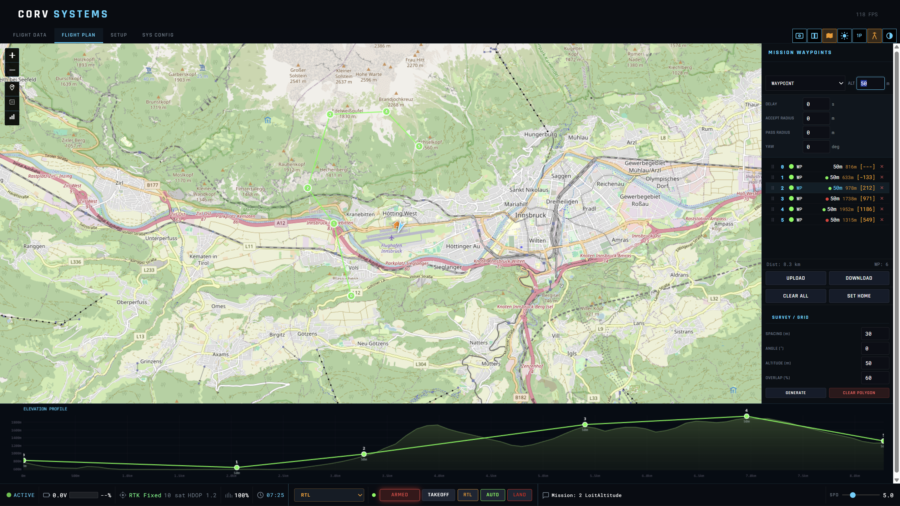

<p align="center">
  
</p>

<h1 align="center">CORV GCS</h1>

<p align="center">
  <b>A modern, 3D Ground Control Station for ArduPilot</b><br>
  Built with Electron + Three.js | Windows & Linux
</p>

<p align="center">
  
  
  
  
</p>

---

**CORV GCS** is a desktop Ground Control Station designed for ArduPilot-based vehicles (Plane, Copter, Rover, VTOL). It features immersive 3D terrain visualization using real SRTM elevation data, full mission planning, real-time telemetry, and a modern UI — all in a lightweight Electron application.

> This project is under active development. Feedback, bug reports, and feature requests are welcome!

---

## Key Features

### 3D Terrain Visualization
- Real-time 3D terrain rendering using **SRTM .hgt elevation data**
- Chunk-based LOD system with satellite imagery overlay
- Dynamic **hillshade** rendering with realistic sun positioning (time-of-day aware)
- Wireframe overlay with proximity-based display
- First-person (pilot) and third-person (observer) camera modes
- 3D aircraft model rendering (GLB/GLTF)
- Flight trail visualization (up to 50,000 points)

### Mission Planning
- Full mission editor with **40+ ArduPilot MAV_CMD commands** organized by category:
  - Navigation (waypoints, loiter, takeoff, land, RTL, VTOL transitions)
  - Conditions (delay, altitude change, yaw)
  - DO commands (set mode, jump, speed change, ROI, mount control)
  - Camera/Gimbal (trigger distance, shutter, capture)
- **Polygon survey tool** — draw an area and auto-generate survey grid waypoints
- **Elevation profile** strip along the mission path
- Terrain-relative altitude support (AGL)
- Mission upload/download to vehicle
- Save/load mission files (JSON)

### Real-Time Telemetry
- **HUD (Heads-Up Display)** — aviation-style primary flight display with artificial horizon, attitude, airspeed, altitude, vertical speed, and G-load graph
- **Navigation Display (ND)** — 2D instrument panel with flight data
- **Mini-Map** — Leaflet-based 2D satellite map with vehicle position
- **Telemetry graphs** — real-time Plotly charts for airspeed, altitude, attitude, G-load
- **Status panel** — GPS fix, battery voltage/current, link quality, flight mode
- Split-view mode: 3D + 2D map + ND simultaneously

### Connectivity
- **Serial** telemetry (USB radio, SiK, etc.) — configurable baud rate
- **UDP** connection (default `127.0.0.1:14550`)
- **TCP** connection (for SITL via WSL: `127.0.0.1:5760`)
- MAVLink 2.0 protocol (ardupilotmega dialect)

### SITL Integration
- Built-in **ArduPilot SITL launcher** — downloads and runs pre-built SITL binaries
- Supports Plane, Copter, Rover, Sub, Helicopter, QuadPlane
- WSL integration for Windows users
- One-click start with automatic connection

### RTK GPS Support
- **RTCM3 correction injection** via `GPS_RTCM_DATA` MAVLink messages
- U-Blox F9P base station support (serial)
- RTK fix status, accuracy, and baseline monitoring

### FPV Camera
- **RTSP video stream** integration (default: SIYI HM30)
- FFmpeg-based real-time MJPEG conversion
- Live video overlay in the main interface

### Telemetry Forwarding
- Forward live telemetry to external serial devices
- MAVLink passthrough and **LTM (Lightweight Telemetry)** protocol output
- Antenna tracker integration

### Flight Logging
- **CRV binary format** — compact flight logs (~930 bytes/sec, ~3.3 MB/hour)
- Auto-start recording on vehicle connection
- Log playback with adjustable speed
- CRC-16-CCITT data validation

### Additional Features
- Full **parameter editor** — read, write, and monitor vehicle parameters in real-time
- **Joystick/gamepad** support with RC channel override and calibration
- Predicted trajectory corridor visualization
- Cross-platform: Windows (NSIS installer) and Linux (AppImage, .deb)

---

## Screenshots


*Aviation-style HUD with artificial horizon, airspeed, altitude, and G-load*


*Mission editor with waypoints, polygon survey, and elevation profile*

---

## Installation

### Download
Pre-built installers are available on the [Releases](https://github.com/Xarin94/Corv-GCS/releases) page:
- **Windows**: `CORV GCS Setup 1.2.1.exe`
- **Linux**: `.AppImage` or `.deb`

### Build from Source

**Prerequisites:** [Node.js](https://nodejs.org/) (v18+) and npm.

```bash
# Clone the repository
git clone https://github.com/Xarin94/Corv-GCS.git
cd Corv-GCS

# Install dependencies
npm install

# Rebuild native modules for Electron
npx electron-rebuild

# Run in development mode
npm start

# Build installers
npm run build          # Windows + Linux
npm run build:win      # Windows only
npm run build:linux    # Linux only
```

Build output goes to the `dist/` directory.

---

## Local Data Setup

CORV GCS loads terrain data, 3D models, and flight logs from specific folders inside the **application installation directory**. After installing, navigate to the install location to find (or create) these folders:

```
CORV GCS/                         <-- installation folder
├── topography/   (or topo/)      <-- SRTM .hgt terrain files
├── models/                       <-- 3D aircraft models (.glb/.gltf)
└── ...
```

**Default installation paths:**

| Platform | Path |
|----------|------|
| **Windows** | `C:\Program Files\CORV GCS\` (or custom path chosen during install) |
| **Linux (.deb)** | `/opt/CORV GCS/` |
| **Linux (AppImage)** | Portable — same folder as the AppImage |

Flight logs are saved separately in the **user data** folder:

| Platform | Logs Path |
|----------|-----------|
| **Windows** | `%APPDATA%\CORV GCS\logs\` |
| **Linux** | `~/.config/CORV GCS/logs/` |

### Terrain Data (SRTM HGT)

CORV GCS uses **SRTM .hgt files** for 3D terrain elevation rendering. Both resolutions are supported, but **SRTM1 (1 arc-second, ~30 m) is recommended** for the best detail:

| Format | Resolution | Grid Size | File Size | Detail |
|--------|-----------|-----------|-----------|--------|
| **SRTM1** | 1 arc-second (~30 m) | 3601 x 3601 | ~25 MB | **Recommended** |
| SRTM3 | 3 arc-second (~90 m) | 1201 x 1201 | ~2.8 MB | Lower detail |

**How to set up:**

1. Download **SRTM1** `.hgt` files for your area of interest from [OpenTopography](https://portal.opentopography.org/raster?opentopoID=OTSRTM.082015.4326.1) or [USGS EarthExplorer](https://earthexplorer.usgs.gov/)
2. Place them in the `topography/` (or `topo/`) folder inside the installation directory
3. Files follow the naming convention `N45E011.hgt` (latitude/longitude of the SW corner)

The terrain system automatically loads the correct tiles based on the vehicle's GPS position. You can also manually load `.hgt` files from the UI.

> **Tip:** Each SRTM1 tile covers a 1x1 degree area. Download only the tiles you need for your flying area.

### 3D Aircraft Models

You can load custom aircraft models in **GLB/GLTF** format:

1. Place your `.glb` or `.gltf` file in the `models/` folder inside the installation directory
2. Select it from the settings panel in the app — available models are listed automatically

---

## Connection Guide

| Method | Use Case | Default |
|--------|----------|---------|
| **Serial** | USB telemetry radio (SiK, RFD900, etc.) | 57600 baud |
| **UDP** | MAVProxy, MAVLink router | `127.0.0.1:14550` |
| **TCP** | SITL (especially via WSL) | `127.0.0.1:5760` |

---

## Tech Stack

| Component | Technology |
|-----------|-----------|
| Framework | Electron 39 |
| 3D Engine | Three.js r128 |
| 2D Maps | Leaflet 1.9.4 |
| Charts | Plotly.js 2.27 |
| Protocol | node-mavlink 2.3 |
| Serial | serialport 13.0 |

---

## Project Structure

```
corv-gcs/
├── main.js                 # Electron main process
├── main-mavlink.js         # MAVLink serial/UDP/TCP handler
├── preload.js              # IPC security bridge
├── sitl-manager.js         # SITL launcher
├── rtk-manager.js          # RTK base station manager
├── fpv-manager.js          # RTSP video stream manager
├── telforward-manager.js   # Telemetry forwarding
├── js/
│   ├── core/               # Constants, state, utilities
│   ├── engine/             # 3D scene, trajectory, sun position
│   ├── terrain/            # Terrain loading, chunks, hillshade
│   ├── maps/               # Leaflet mini-map
│   ├── mavlink/            # MAVLink message routing
│   ├── mission/            # Mission command definitions
│   ├── ui/                 # UI controllers & panels
│   ├── hud/                # HUD canvas rendering
│   ├── joystick/           # Gamepad input
│   ├── playback/           # Flight log playback
│   └── logging/            # CRV binary logger
├── html/                   # HTML pages & components
├── css/                    # Stylesheets
├── assets/                 # Icons & logos
├── topo/                   # SRTM .hgt terrain files
├── models/                 # 3D aircraft models (GLB)
└── flightplans/            # Example mission files
```

---

## Contributing

Contributions are welcome! Feel free to:
- Report bugs or request features via [GitHub Issues](https://github.com/Xarin94/Corv-GCS/issues)
- Submit pull requests
- Share screenshots or videos of your setup

---

## License

This project is licensed under the [Apache License 2.0](LICENSE).

---
