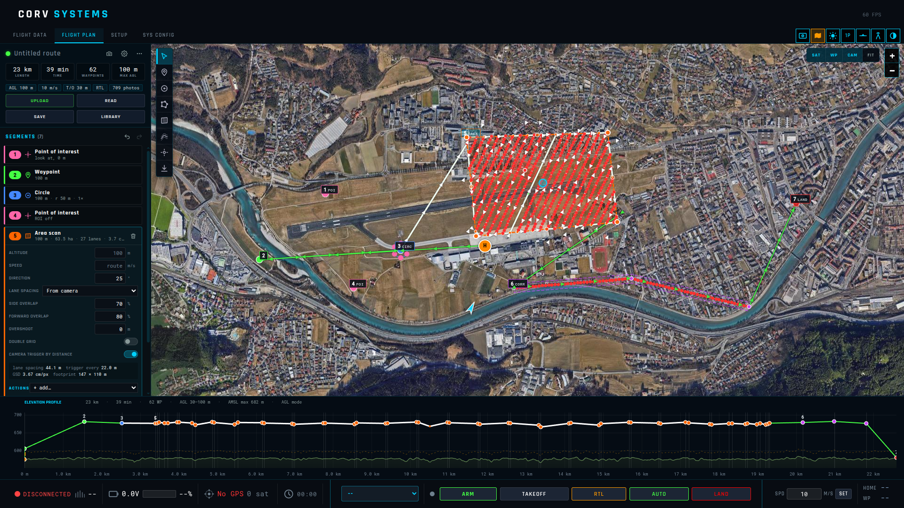

<p align="center">
  
</p>

<h1 align="center">CORV GCS</h1>

<p align="center">
  <b>A modern, 3D Ground Control Station for ArduPilot</b><br>
  Built with Electron + Three.js | Windows & Linux
</p>

<p align="center">
  
  
  
  
  
</p>

---

**CORV GCS** is a desktop Ground Control Station designed for ArduPilot-based vehicles (Plane, Copter, Rover, Sub, Heli, VTOL). It features immersive 3D terrain visualization using real SRTM elevation data, full mission planning, real-time telemetry, and a modern UI — all in a lightweight Electron application.

It also speaks the **CORV binary protocol** for the onboard CORV autopilot and reads **MSP/MSP2 telemetry** from INAV and Betaflight flight controllers. Every protocol is decoded in the main process and normalised to MAVLink, so all three drive the same HUD, 3D view and instruments.

> This project is under active development. Feedback, bug reports, and feature requests are welcome!

---

## Key Features

### 3D Terrain Visualization
- Real-time 3D terrain rendering using **SRTM .hgt elevation data**
- Chunk-based LOD system with satellite imagery overlay
- Dynamic **hillshade** rendering with realistic sun positioning (time-of-day aware)
- Wireframe overlay with proximity-based display
- First-person (pilot) and third-person (observer) camera modes, plus a **horizon-lock** view
- **Per-airframe 3D models**, selected automatically from the vehicle's `MAV_TYPE`
- Flight trail visualization (up to 50,000 points)
- Keyboard view toggles: `T` tilt +90°, `P` trajectory, `M` satellite, `L` sunlight

### Mission Planning
- Full mission editor with **40+ ArduPilot MAV_CMD commands** organized by category:
  - Navigation (waypoints, loiter, takeoff, land, RTL, VTOL transitions)
  - Conditions (delay, altitude change, yaw)
  - DO commands (set mode, jump, speed change, ROI, mount control)
  - Camera/Gimbal (trigger distance, shutter, capture)
- **Polygon survey tool** — draw an area and auto-generate survey grid waypoints
- **Elevation profile** strip along the mission path
- Terrain-relative altitude support (AGL)
- Mission upload to vehicle
- **Undo / redo** on every edit (`Ctrl+Z` / `Ctrl+Y`), 100 steps deep
- **Local mission library** — save, recall, overwrite, rename and delete missions stored
  next to the installation, with an `index.json` catalogue rebuilt from the folder contents

### Real-Time Telemetry
- **HUD (Heads-Up Display)** — IFR-style primary flight display with artificial horizon, attitude, airspeed, altitude, vertical speed and G-load graph
- **Perspective-conformal HUD markers** and an air-relative flight-path vector
- **Total G-load** computed from all three axes, on live MAVLink and SITL alike
- **Total-energy variometer** alongside the VSI
- **ROTOR LOAD** schematic on the flight data screen
- **Navigation Display (ND)** — 2D instrument panel with flight data
- **Mini-Map** — Leaflet-based 2D satellite map with vehicle position
- **Telemetry graphs** — real-time Plotly charts for airspeed, altitude, attitude, G-load
- **Status panel** — GPS fix, battery voltage/current, link quality, flight mode
- Split-view mode: 3D + 2D map + ND simultaneously

### Connectivity
- **Serial** telemetry (USB radio, SiK, etc.) — configurable baud rate
- **UDP** connection (default `127.0.0.1:14550`)
- **TCP** connection (for SITL via WSL: `127.0.0.1:5760`)
- MAVLink 2.0 protocol (ardupilotmega dialect)
- **MSP / MSP2** over serial or TCP for **INAV and Betaflight** — telemetry only
  (attitude, GPS, altitude, battery, RC, flight mode from the active mode boxes),
  with a normal and a slow-link poll profile
- **CORV binary** protocol v7/v8 for the onboard CORV autopilot

### SITL Integration
- Built-in **ArduPilot SITL launcher** — downloads and runs pre-built SITL binaries
- Supports Plane, Copter, Rover, Sub, Helicopter, QuadPlane
- WSL integration for Windows users
- One-click start with automatic connection

### RTK GPS Support
- **RTCM3 correction injection** via `GPS_RTCM_DATA` MAVLink messages
- U-Blox F9P base station support (serial)
- **NTRIP client** with sourcetable browsing
- RTK fix status, accuracy, and baseline monitoring

### FPV Camera
- **RTSP video stream** integration (default: SIYI HM30)
- FFmpeg-based real-time MJPEG conversion
- Live video overlay in the main interface

### Telemetry Forwarding
- Forward live telemetry to external serial devices, or mirror it over UDP
- MAVLink passthrough and **LTM (Lightweight Telemetry)** protocol output
- Antenna tracker integration

### Flight Logging
- **`.tlog` recording** of the live MAVLink stream, auto-started on connection
- **CRV binary format** — compact flight logs (~930 bytes/sec, ~3.3 MB/hour)
- Replay of `.tlog` and ArduPilot `.bin` DataFlash logs with adjustable speed
- CRC-16-CCITT data validation

### Parameter Editor
- Read, write and monitor vehicle parameters in real time
- **On-demand single reads** — pick a parameter from the side catalogue and fetch just
  that one, instead of downloading the full list. On a 19200-baud SiK or a LoRa link a
  full `PARAM_REQUEST_LIST` is minutes of airtime; a single read is two packets
- Catalogue of known parameter names per vehicle class, which **learns** every name seen
  from a vehicle or a `.param` file and remembers it for later offline sessions
- Starred parameters, group filter, per-request timeout for high-latency links
- Save and load `.param` files

### Additional Features
- **Joystick/gamepad** support with RC channel override and calibration
- Predicted trajectory corridor visualization
- ADS-B traffic awareness
- Offline satellite tile and SRTM elevation downloader with on-disk cache
- Cross-platform: Windows (NSIS installer) and Linux (AppImage, .deb)

---

## Screenshots


*Aviation-style HUD with artificial horizon, airspeed, altitude, and G-load*


*Mission editor with waypoints, polygon survey, and elevation profile*

---

## Installation

### Download
Pre-built installers are available on the [Releases](https://github.com/Xarin94/Corv-GCS/releases) page:
- **Windows**: `CORV GCS Setup 1.5.0.exe`

Linux builds are not published at the moment — build from source with `npm run build:linux`.

### Build from Source

**Prerequisites:** [Node.js](https://nodejs.org/) (v18+) and npm.

```bash
# Clone the repository
git clone https://github.com/Xarin94/Corv-GCS.git
cd Corv-GCS

# Install dependencies
npm install

# Rebuild native modules for Electron
npx electron-rebuild

# Run in development mode
npm start

# Build installers
npm run build          # Windows + Linux
npm run build:win      # Windows only
npm run build:linux    # Linux only
```

Build output goes to the `dist/` directory.

---

## Local Data Setup

CORV GCS loads terrain data and 3D models from folders inside the **application installation directory**, and writes missions, logs and its catalogue into a `data/` folder in the same place:

```
CORV GCS/                         <-- installation folder
├── topography/   (or topo/)      <-- SRTM .hgt terrain files       (you provide)
├── models/                       <-- 3D aircraft models (.glb/.gltf) (you provide)
└── data/                         <-- created on first run
    ├── index.json                <-- catalogue of missions and logs
    ├── missions/                 <-- saved missions (.json)
    └── logs/                     <-- .tlog / .crv flight logs
```

**Default installation paths:**

| Platform | Path |
|----------|------|
| **Windows** | `C:\Program Files\CORV GCS\` (or custom path chosen during install) |
| **Linux (.deb)** | `/opt/CORV GCS/` |
| **Linux (AppImage)** | Portable — same folder as the AppImage |

> **Installing under `Program Files`?** That folder is not writable without elevation, so
> `data/` automatically falls back to the per-user data folder (`%APPDATA%\CORV GCS\data\`
> on Windows, `~/.config/CORV GCS/data/` on Linux). The mission library shows the real
> path in use, highlighted in amber when it is the fallback. To keep the installation
> self-contained, install somewhere writable — the whole folder can then be copied to
> another machine with missions and logs intact.

`index.json` is a convenience catalogue for external tools: it is **rebuilt from the folder
contents** every time the library is opened or a mission is saved, so deleting it or dropping
a mission file in by hand are both safe.

### Terrain Data (SRTM HGT)

CORV GCS uses **SRTM .hgt files** for 3D terrain elevation rendering. Both resolutions are supported, but **SRTM1 (1 arc-second, ~30 m) is recommended** for the best detail:

| Format | Resolution | Grid Size | File Size | Detail |
|--------|-----------|-----------|-----------|--------|
| **SRTM1** | 1 arc-second (~30 m) | 3601 x 3601 | ~25 MB | **Recommended** |
| SRTM3 | 3 arc-second (~90 m) | 1201 x 1201 | ~2.8 MB | Lower detail |

**How to set up:**

1. Download **SRTM1** `.hgt` files for your area of interest from [OpenTopography](https://portal.opentopography.org/raster?opentopoID=OTSRTM.082015.4326.1) or [USGS EarthExplorer](https://earthexplorer.usgs.gov/)
2. Place them in the `topography/` (or `topo/`) folder inside the installation directory
3. Files follow the naming convention `N45E011.hgt` (latitude/longitude of the SW corner)

The terrain system automatically loads the correct tiles based on the vehicle's GPS position. You can also manually load `.hgt` files from the UI.

> **Tip:** Each SRTM1 tile covers a 1x1 degree area. Download only the tiles you need for your flying area.

### 3D Aircraft Models

You can load custom aircraft models in **GLB/GLTF** format:

1. Place your `.glb` or `.gltf` file in the `models/` folder inside the installation directory
2. Select it from the settings panel in the app — available models are listed automatically

---

## Connection Guide

| Method | Protocol | Use Case | Default |
|--------|----------|----------|---------|
| **MAVLink Serial** | MAVLink 2 | USB telemetry radio (SiK, RFD900, etc.) | 57600 baud |
| **MAVLink UDP** | MAVLink 2 | MAVProxy, MAVLink router | `127.0.0.1:14550` |
| **MAVLink TCP** | MAVLink 2 | SITL (especially via WSL) | `127.0.0.1:5760` |
| **CORV Binary** | CORV v7/v8 | Onboard CORV autopilot over USB | 460800 baud |
| **MSP Serial** | MSP / MSP2 | INAV or Betaflight flight controller over USB | 115200 baud |
| **MSP TCP** | MSP / MSP2 | INAV SITL | `127.0.0.1:5760` |

MSP is request/response, not a stream: the GCS polls the flight controller, so the poll
profile *is* the telemetry rate. Use **Normal** on USB and **Slow link** on a long-range
radio, where a 25 Hz attitude poll would use the whole budget.

---

## Tech Stack

| Component | Technology |
|-----------|-----------|
| Framework | Electron 39 |
| 3D Engine | Three.js r128 |
| 2D Maps | Leaflet 1.9.4 |
| Charts | Plotly.js 2.27 |
| Protocol | node-mavlink 2.3 |
| Serial | serialport 13.0 |

---

## Project Structure

```
corv-gcs/
├── main.js                 # Electron main process
├── main-mavlink.js         # MAVLink serial/UDP/TCP + CORV binary + .tlog recording
├── msp-manager.js          # MSP/MSP2 adapter (INAV, Betaflight)
├── mission-store.js        # Data root: missions/, logs/, index.json
├── preload.js              # IPC security bridge
├── sitl-manager.js         # SITL launcher
├── rtk-manager.js          # RTK base station + NTRIP client
├── fpv-manager.js          # RTSP video stream manager
├── telforward-manager.js   # Telemetry forwarding (LTM / MAVLink / UDP mirror)
├── log-replay-manager.js   # .tlog / .bin replay engine
├── log-replay-bin-parser.js# ArduPilot DataFlash .bin parser
├── js/
│   ├── core/               # Constants, state, utilities
│   ├── engine/             # 3D scene, trajectory, sun position
│   ├── terrain/            # Terrain loading, chunks, hillshade
│   ├── maps/               # Leaflet mini-map, tile cache, offline downloader
│   ├── mavlink/            # MAVLink message routing & commands
│   ├── mission/            # Command catalog, undo/redo history, mission library
│   ├── ui/                 # UI controllers & panels
│   ├── hud/                # HUD canvas rendering
│   ├── adsb/               # ADS-B traffic
│   ├── joystick/           # Gamepad input
│   ├── serial/             # CORV binary link
│   └── logging/            # tlog logger, replay controller
├── html/                   # HTML pages & components
├── css/                    # Stylesheets
├── assets/                 # Icons & logos
├── docs/                   # Architecture & work tracker
├── topo/                   # SRTM .hgt terrain files
├── models/                 # 3D aircraft models (GLB)
└── data/                   # Runtime: missions, logs, index.json (created on first run)
```

---

## Contributing

Contributions are welcome! Feel free to:
- Report bugs or request features via [GitHub Issues](https://github.com/Xarin94/Corv-GCS/issues)
- Submit pull requests
- Share screenshots or videos of your setup

---

## License

This project is licensed under the [Apache License 2.0](LICENSE).

---
