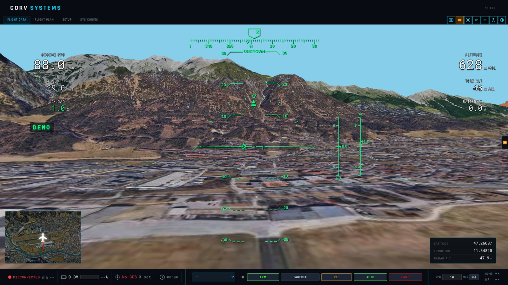
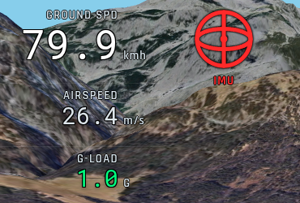
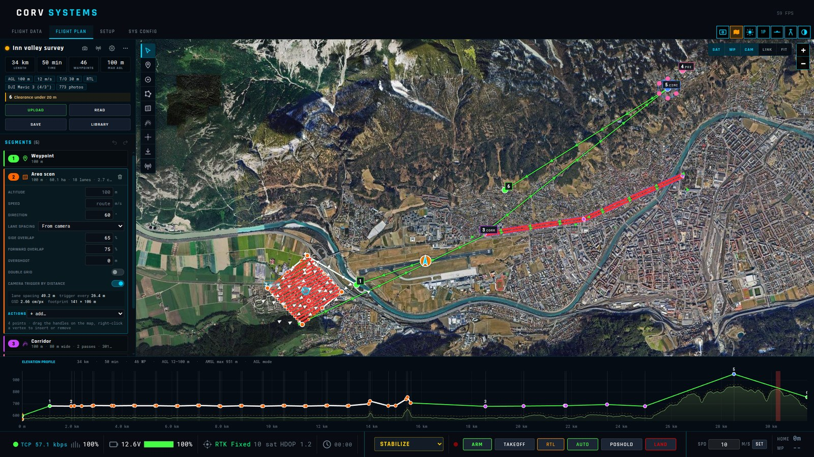
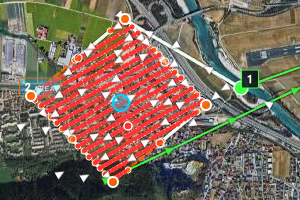
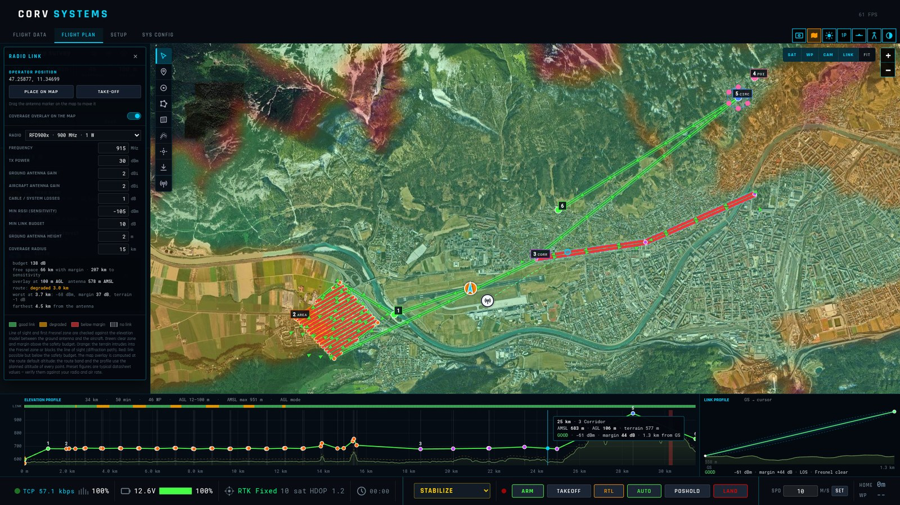
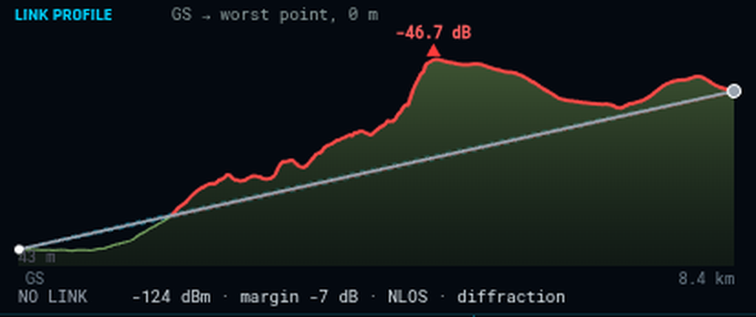
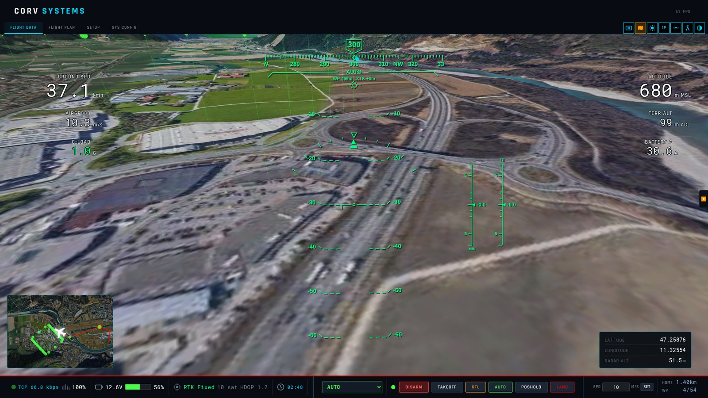
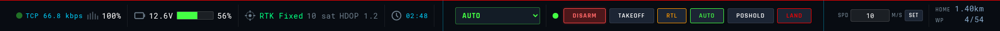
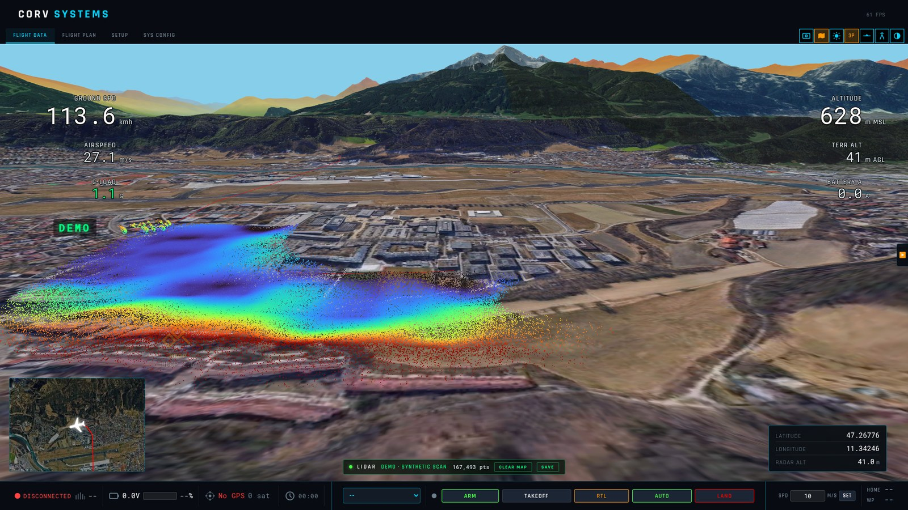
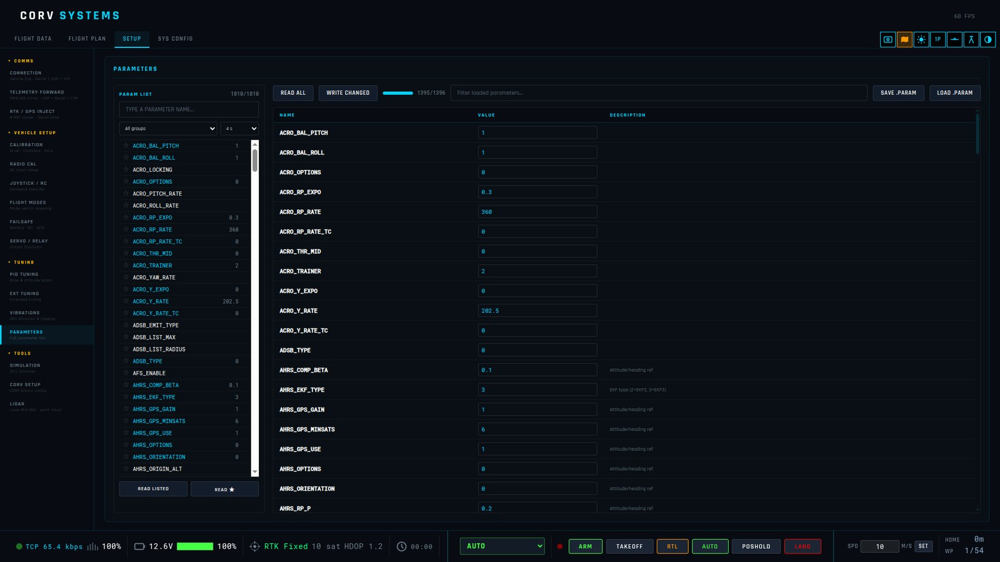

<p align="center">
  
</p>

<h1 align="center">CORV GCS</h1>

<p align="center">
  <b>A 3D ground control station for ArduPilot drones</b><br>
  Windows &amp; Linux · Electron + Three.js
</p>

<p align="center">
  
  
  
  
  
</p>

---

A ground control station is the software on the laptop that talks to the drone: it shows what the
aircraft is doing, lets you plan a flight and sends it to the autopilot. CORV GCS does that for
ArduPilot vehicles (Plane, Copter, Rover, Sub, Heli, VTOL) on a **real 3D model of the terrain**,
built from the same elevation data used by mapping services, with satellite imagery on top.

It also reads INAV / Betaflight controllers over **MSP** and the onboard CORV autopilot over its
binary protocol; the interface is in **English and Simplified Chinese**.



---

## Flight screen

You see what the aircraft sees: the terrain ahead in 3D, with an aviation-style head-up display
over it. Speed, altitude, heading, vertical speed and G-load are drawn the way an airliner's primary
flight display draws them — the pitch ladder, the flight-path marker and the bank arc follow the
same conventions as a Garmin or Boeing HUD, so the picture reads at a glance.

<p align="center"></p>

A column of **annunciators** beside the speed tape flags anything wrong with the vehicle: red
warnings from the top, amber cautions from the bottom. They are the same conditions Mission Planner
checks — GPS quality, compass and IMU health, vibration, EKF variance, radio signal, failsafes —
each shown with its own icon and the number behind it (satellites and HDOP under the GPS flag, RSSI
under the link one).

## Flight stack

**SYS CONFIG → FLIGHT STACK** tells the GCS which firmware it is talking to: **ArduPilot**,
**INAV** or **Betaflight**. That one choice pre-selects the right link on the connection page
(MAVLink serial at 57600, MSP at 115200) and decides what the rest of the app offers.

On INAV the mission is planned exactly the same way and uploaded over MSP as an INAV waypoint
list — navigation and hold points, POI, heading, speed, landing and return to home, with the
altitudes the terrain model worked out. What the INAV format has no room for is greyed out while
you plan, with the reason on the control itself rather than an error at upload time: no loiter
circles, no spline legs, no take-off waypoint, no camera, gimbal, servo or relay actions, and a
budget of 60 waypoints — the board's own figure once it is connected. Betaflight has no
navigation stack, so the Flight Plan page is greyed out entirely. On either of them the setup
screens that only speak MAVLink — parameters, calibration, tuning, failsafe, RTK inject — are
greyed out too, each one saying where that setting actually lives.

## Mission planning

You draw the mission as shapes, not as a list of commands: a waypoint, a circle to loiter in, a
perimeter to fly around, an area to photograph, a corridor to follow, a point the camera should
look at, a landing. The route between them is calculated for you a moment after every edit — for
an area scan the parallel lanes come from the camera model, so a DJI Mavic 3 at 100 m gives 49 m
between lanes, a photo every 26 m and 2.7 cm per pixel on the ground.



<p align="center"></p>

Every planned photo is a red dot on the route; hover one and the rectangle it will cover on the
ground appears. The **elevation profile** along the bottom shows the ground under the whole route
and the height the aircraft will fly at: the autopilot flies straight from one waypoint to the
next, so each leg is checked against the terrain and a leg that would clip a hill is listed on the
route card ("Clearance under 20 m" on segment 6 in the picture) before you upload anything.

## Radio link coverage

A drone is only as far away as its radio can reach, and hills get in the way. Pick your radio from
the list (RFD900x, SiK, Herelink, Microhard, Doodle Labs, ExpressLRS, Crossfire — or type the
transmit power, antenna gains and sensitivity of your own), place the operator on the map and turn
the **LINK** layer on: the map shows in light green where the link will be good, in orange where
the terrain degrades it, in red where it will work but with too little margin, and nothing where
it will not work at all.



<p align="center"></p>

The check is the one an RF planner would do: a straight line of sight from the antenna to the
aircraft, the **first Fresnel zone** around it (the radio needs that ellipse clear, not just the
line), the loss when a ridge cuts into it, and the curvature of the Earth. The **LINK PROFILE** cut
shows it for the point under the cursor or for the worst point of the route — in the picture a
mountain between operator and aircraft costs 46.7 dB and the link is lost.

## Flying the mission

One button uploads the plan to the autopilot; **READ** brings back the mission stored on it. The
command bar keeps the flight mode, battery, GPS quality and the waypoint being flown in view, with
ARM, TAKEOFF, RTL, AUTO and LAND at hand — the picture is a simulated copter flying the plan above,
on waypoint 4 of 54.





Every flight is recorded as a `.tlog` from the moment the link comes up, and both `.tlog` and
ArduPilot `.bin` logs can be replayed on the same screen, with a timeline to scrub through.

## LiDAR point cloud

With a Livox Mid-360 laser scanner on the aircraft, a 3D map of the ground builds up live on the
screen. The scanner sends its points over the network link and CORV GCS places each one on the map
from the aircraft position and attitude in the telemetry — about 170,000 points in the picture, coloured
by height; the map can be saved as a `.ply` file for other software.



## Setup and parameters

The vehicle connects over a USB telemetry radio, UDP or TCP, and a built-in **ArduPilot simulator**
(SITL) starts with one click when you want to try things without an aircraft. The parameter editor
reads a single parameter on request instead of the full list of a thousand — on a slow long-range
radio that is the difference between two packets and several minutes.



## Also on board

- **RTK GPS**: corrections from a base station or an NTRIP caster are forwarded to the drone, for centimetre-level positioning.
- **FPV video**: an RTSP camera stream (SIYI HM30 and similar) shown over the 3D view.
- **Joystick**: fly with a gamepad through RC override, with per-axis calibration.
- **Telemetry forwarding**: mirror the link over UDP or output MAVLink / LTM to an antenna tracker.
- **ADS-B traffic**: nearby aircraft on the map.
- **Offline maps**: satellite tiles and elevation data cached on disk, so the app starts and works without a network.

---

## Installation

Installers are on the [Releases](https://github.com/Xarin94/Corv-GCS/releases) page:
**Windows** `CORV GCS Setup 1.7.1.exe` · **Linux** `CORV GCS-1.7.1.AppImage` or `corv-gcs_1.7.1_amd64.deb`.

To run from source you need [Node.js](https://nodejs.org/) 18 or newer:

```bash
git clone https://github.com/Xarin94/Corv-GCS.git
cd Corv-GCS
npm install
npx electron-rebuild     # native serial-port module for Electron
npm start                # run
npm run build            # installers for Windows + Linux → dist/
```

## Terrain data and local files

The 3D terrain comes from SRTM `.hgt` elevation tiles (one file per 1° × 1° square, ~25 MB each at
30 m resolution). The tiles under the vehicle are downloaded automatically when a network is
available; you can also put your own files in `topography/` inside the installation folder, from
[OpenTopography](https://portal.opentopography.org/raster?opentopoID=OTSRTM.082015.4326.1) or
[USGS EarthExplorer](https://earthexplorer.usgs.gov/), named like `N47E011.hgt`.

Missions, flight logs and LiDAR maps are written to a `data/` folder next to the installation
(`data/missions`, `data/logs`, `data/lidar`) — under `Program Files`, where that is not allowed,
they go to the per-user data folder and the mission library shows the path in use. Custom aircraft
models (`.glb` / `.gltf`) go in `models/`.

## Connection guide

| Method | Protocol | Typical use | Default |
|--------|----------|-------------|---------|
| Serial | MAVLink 2 | USB telemetry radio (SiK, RFD900…) | 57600 baud |
| UDP | MAVLink 2 | MAVProxy, MAVLink router | `127.0.0.1:14550` |
| TCP | MAVLink 2 | SITL, also through WSL on Windows | `127.0.0.1:5760` |
| Serial / TCP | MSP / MSP2 | INAV or Betaflight controller — telemetry, and waypoint missions on INAV | 115200 baud |
| Serial | CORV binary | Onboard CORV autopilot over USB | 460800 baud |

## Documentation

[ARCHITECTURE.md](ARCHITECTURE.md) describes every module and data flow; [docs/LIDAR.md](docs/LIDAR.md)
covers the Livox setup. Bug reports and feature requests are welcome in the
[issues](https://github.com/Xarin94/Corv-GCS/issues).

## License

[Apache License 2.0](LICENSE)
