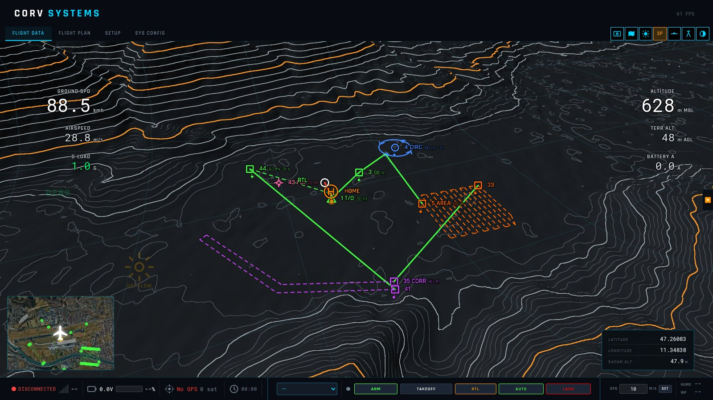
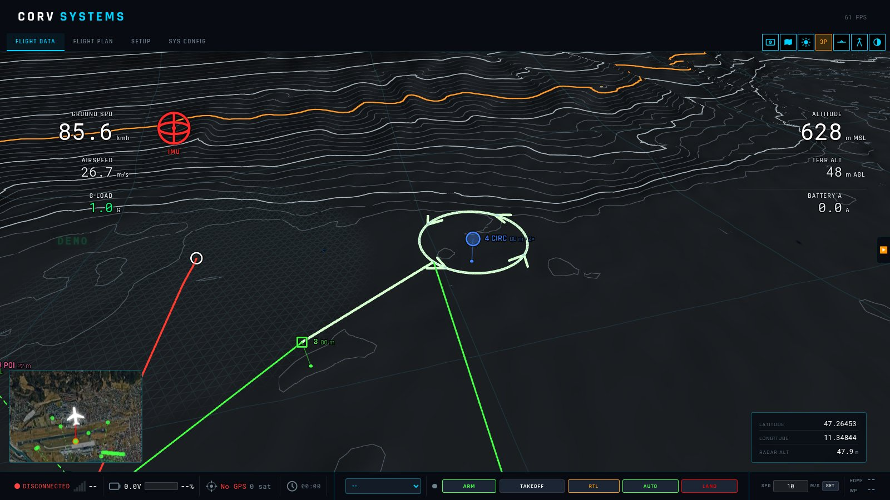
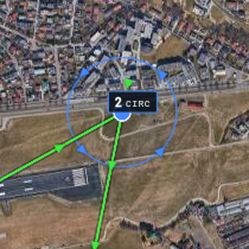
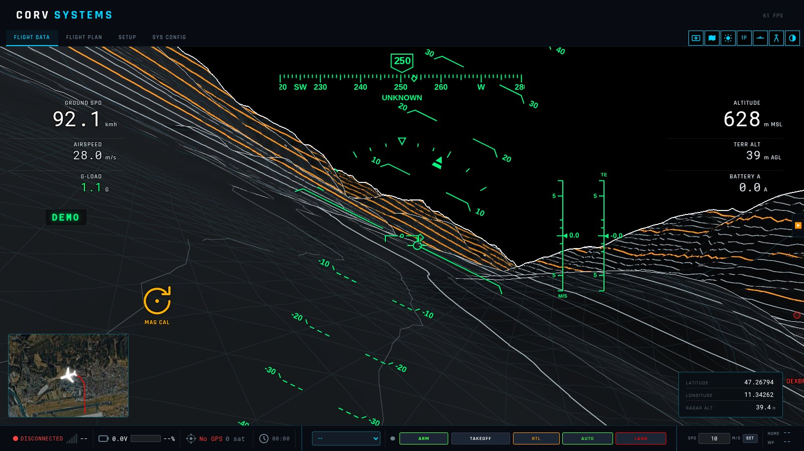
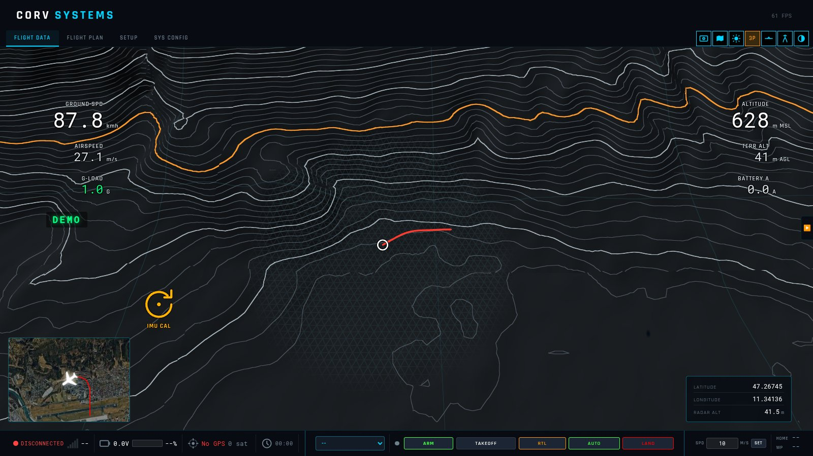
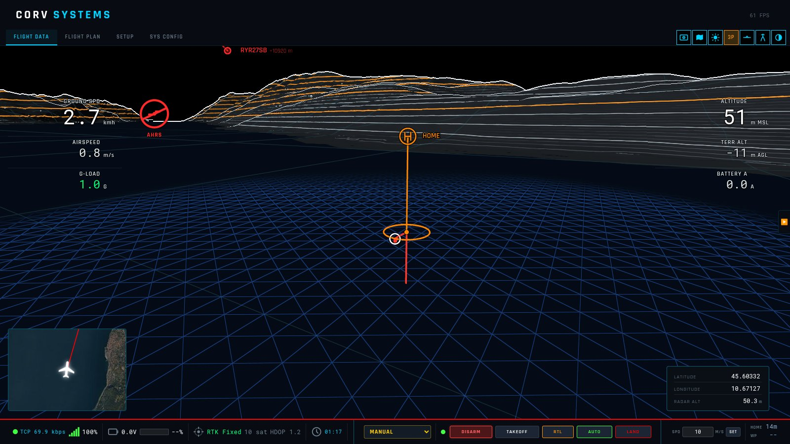
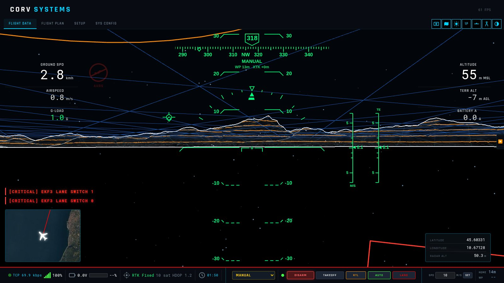
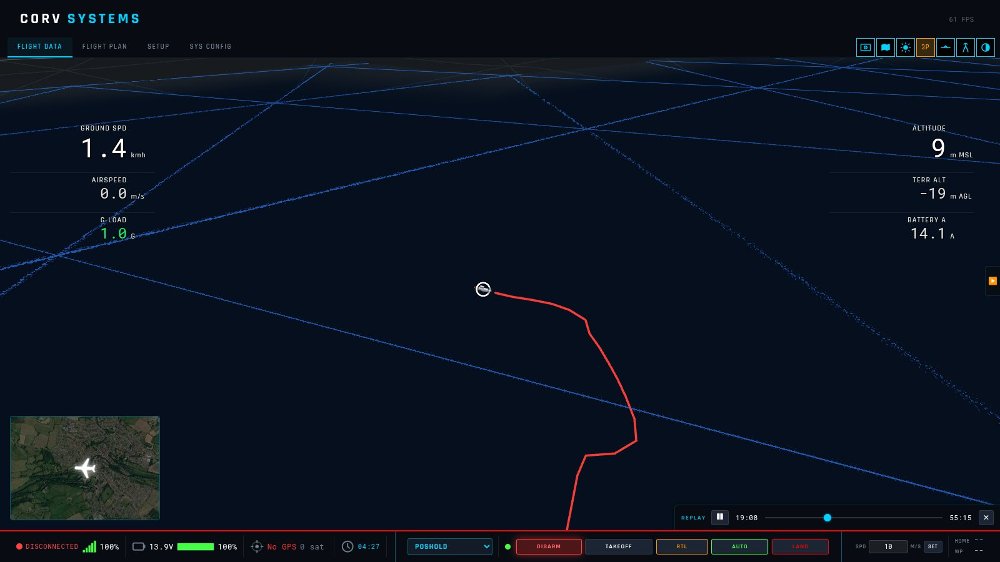
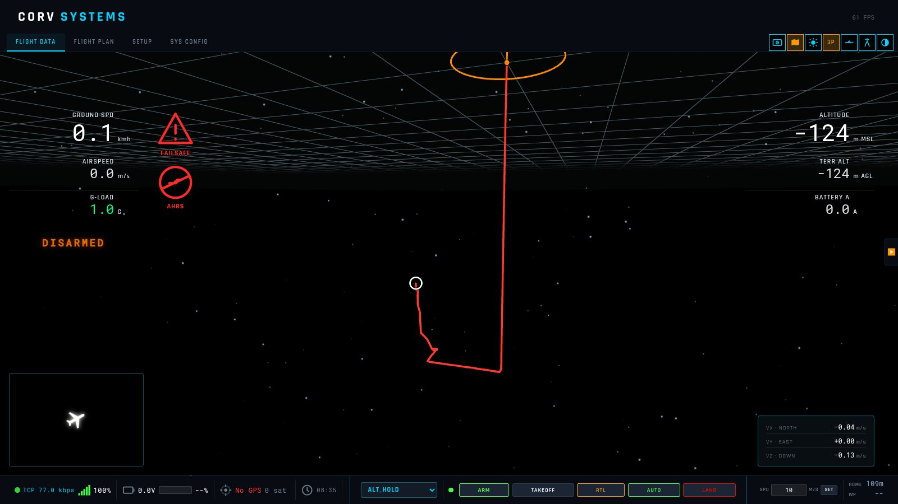
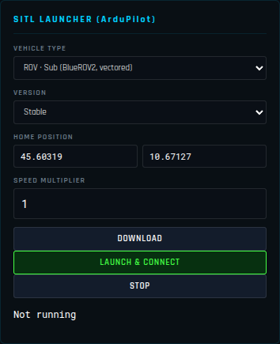

# 3D view: missions, low flying, water, ROVs and navigation without GPS

What the 3D view draws for a mission, for an aircraft close to the ground, for a vehicle on or under
water, and what the GCS does when the vehicle has no GPS at all. Everything here is in CORV GCS
1.7.5; the measurements quoted come from ArduPilot SITL runs and from real BlueROV2 logs.

| | |
|---|---|
| [1. The mission in 3D](#1-the-mission-in-3d) | patterns, circles, landing, RTL, POI as the flight plan page draws them |
| [2. Low-altitude grid](#2-low-altitude-grid) | triangles on the ground under 200 m, the height cue |
| [3. Water](#3-water) | lakes and seas found in the elevation data, the surface, under the surface |
| [4. Subs and ROVs](#4-subs-and-rovs) | depth, the water a ROV dives in, a real BlueROV2 dive |
| [5. Navigation without GPS](#5-navigation-without-gps) | relative mode, dead reckoning, what ArduPilot sends |
| [6. ROV in the simulator](#6-rov-in-the-simulator) | ArduSub SITL on Lake Garda, with and without GPS |
| [7. Reference](#7-reference) | every threshold and size in one table |

Most of this lives in the **schematic view** (satellite imagery off, key **M**): the contour chart
is where a grid, a water surface and a zero plane can be drawn without hiding anything.

---

## 1. The mission in 3D

The 3D view draws the mission the way the Flight Plan page does, in the same colours, so the two
read alike. A survey is one figure, not three hundred waypoints.

| Item | Drawn as |
|------|----------|
| Waypoint | Green route line, a square symbol, its sequence number and height above ground, a drop line to a dot on the ground. A hold time is added to the label (`80 m · 5 s`). |
| Area scan, corridor, perimeter | The passes as a **thinner dashed line in the segment colour** (orange, purple, amber). Only the entry and exit points get a symbol: the entry is labelled with the segment (`5 AREA 80 m`), the exit with its number. The transit legs to and from the pattern stay solid green. |
| Circle | The **loiter ring in blue** at its altitude, with **four chevrons** showing the direction of turn. The route meets the ring at its point nearest to where the vehicle comes from and leaves it from there — as ArduPilot flies a `LOITER_TURNS`, never through the centre. The centre carries the symbol and `4 CIRC 80 m · 2×`. |
| Take-off | A triangle at the take-off height, straight above home. |
| Landing | Across at height, then **straight down** to the ground. A fixed wing's `NAV_LAND` keeps its glide slope. |
| Return to launch (end of mission) | A **dashed green line** back over home at the last height, then down, labelled `RTL`. |
| Point of interest | A **pink target** at the height the camera aims at, on a pole from the ground. |

The item being flown (`MISSION_CURRENT`) is highlighted: its symbol is filled and the path leading
to it is drawn over in pale green — for a circle, the approach and the whole ring.

The Flight Plan page draws the same four arrows on its circles, at the same bearings.

Heights are the ones the route compiler resolved against the elevation model (`altMsl`), in any
altitude mode, so the 3D route and the elevation profile on the plan page agree.

## 2. Low-altitude grid

Low down the contour lines are few and far apart, and a flat valley floor has none: nothing on the
screen says how high the aircraft is. Below 200 m above the ground the schematic view lays a faint
grid of **equilateral triangles, 25 m a side**, on the terrain within **500 m of the aircraft**.
Triangles of a fixed size grow on the screen as the aircraft descends — the height cue.

- In full up to **150 m** above the ground, fading out to nothing at **200 m**, with the same
  height the AGL readout shows.
- Centred on the aircraft, not on the camera: in the chase view it stays around the vehicle.
- Draped over the relief and fixed in the world, so it does not jump when the terrain detail
  changes. Where the ground is seen at a grazing angle the three families of lines thin out
  together, so the grid fades as triangles and never turns into streaks.
- Above 200 m, and anywhere beyond 500 m, the shader skips it altogether.

## 3. Water

### How water is found

The terrain comes from SRTM elevation tiles, and SRTM **flattens every lake to a single height and
the sea to 0 m**. Real ground is never flat to the metre over a dozen samples, so a point whose
3 × 3 neighbours and the four samples at distance 2 all equal its own height is a water surface.
Tested on real tiles, the test finds the lakes at their levels with almost no false positives:

| Tile | Lakes found |
|------|-------------|
| N45E010 | Garda 62 m, Iseo 182 m, Idro 362 m |
| N45E009 | Como 198 m |
| N47E011 | Starnberger See 583 m, Ammersee 531 m, Walchensee 798 m |

Tiles entirely at sea carry **bathymetry** instead — the sea bed, below 0 (the Gulf of Guinea tile
goes down to −4 900 m). There the terrain drawn is the bed and the surface is at 0.

### What is drawn

- **A water surface** is dark blue, and the low-altitude triangle grid on it is **blue**.
- **The sea bed** (bathymetry) is ground tinted blue; its contour lines are the depth contours.
- **Seen from under the surface** — a camera below a lake or the sea — the surface is a blue
  triangle grid overhead, and **particles** hang in the water around the camera. They are fixed in
  the world, so moving through them shows the direction and speed of travel.
- **No clipping.** A water surface does not hide what is under it: the route, the trail and the
  vehicle itself stay drawn in full under the surface instead of as faint ghosts. Over water the
  vehicle is no longer held above the "ground" (a boat sits on the surface, a ROV dives under it);
  where the data has a sea bed, that is the floor. The chase camera can follow under the surface.

### Limitations

- The water treatment is drawn in the schematic view only; with the satellite imagery on, a lake
  surface still hides what is under it.
- SRTM has no lake bathymetry: under a lake there is no bottom to draw.
- Land below sea level (Dead Sea shore, polders) reads as sea; the Caspian as a surface at 0 m
  instead of −28 m.
- Small lakes, rivers and flooded quarries are often not flattened in SRTM — see the next section
  for what happens when a sub is in one.

## 4. Subs and ROVs

**ArduSub reports depth, not height above the sea.** Its origin is on the surface at 0 m: a real
BlueROV2 and the SITL both report altitudes from 0 down to minus the depth. Drawn as a height above
the sea, a ROV on a lake at 62 m would appear 62 m under the ground.

So for a sub (`MAV_TYPE_SUBMARINE`) the GCS anchors that 0 to the water it dives in: the lake or
sea level under home, else the ground at home, and places the vehicle at that surface plus the
depth (`relative_alt`). The altitude readout is then true MSL, and `TERR ALT` shows minus the depth.

When the elevation data shows no water under the sub — a flooded quarry, a lake SRTM does not
flatten — the sub is still in water: around it (500 m), ground within 1.5 m of its surface is drawn
and treated as that water, with the surface grid and no clipping.

### A real dive

A BlueROV2 Heavy (ArduSub 4.7.1, Cerulean Tracker 650 USBL, Ping360) diving a flooded quarry to
21.7 m, from logs its operator shared on the
[Blue Robotics forum](https://discuss.bluerobotics.com/t/ekf-bad-warning-from-autopilot/23610).
What the vehicle sent over 1 h 40 min:

- **No GPS fix at any time** (`GPS_RAW_INT` fix 0, 0 satellites) — there is none under water.
- The EKF **fused external odometry** from the USBL system and started from a *recorded origin*
  (`AHRS: using recorded origin 51.3452, −2.2548, 0.0`); `LOCAL_POSITION_NED` and
  `GLOBAL_POSITION_INT` were valid, ranging over about 100 m, and `POSHOLD` was used.
- The origin altitude is **0 m**: `relative_alt` from +0.4 to −21.7 m. The external pressure sensor
  (`SCALED_PRESSURE2`) went from 1 017 to 3 131 hPa — 21.6 m of fresh water.
- A downward sonar altimeter (`DISTANCE_SENSOR`, orientation 25) read 0.3–34 m.

In the picture the red trail is the EKF position, aided by the USBL.

## 5. Navigation without GPS

### What ArduPilot sends when it has never had a GPS

Measured on ArduPilot SITL with `GPS1_TYPE 0` and `SIM_GPS1_TYPE 0` from boot:

| | ArduSub 4.7.1 | ArduPlane stable |
|---|---|---|
| EKF3 | Runs in **constant-position mode** (flags 167) | **Never initialises** (flags 1024); DCM only |
| `LOCAL_POSITION_NED` | **Not sent** | **Not sent** |
| `GLOBAL_POSITION_INT` | lat, lon, alt, relative_alt **all 0** | lat, lon **0**; velocity 0 |
| Velocity | EKF velocity is **inertial drift**: 0.9 m/s reported while the vehicle moved 2 m in 40 s | `VFR_HUD` ground speed **0** |
| What is usable | Attitude, heading, depth from `SCALED_PRESSURE2` | Attitude, heading, **airspeed** (pitot), barometer |

ArduPlane dead-reckons on airspeed and its wind estimate after **losing** a GPS it once had; with
no GPS ever there is no origin and no position. An EKF keeps a local position only once it has an
origin — a GPS fix at some point, or an origin set for a DVL or a USBL (as in the real dive above);
then `LOCAL_POSITION_NED` is the position.

### SYS CONFIG → NAVIGATION

| Setting | |
|---------|---|
| **POSITION** | *GPS · absolute* (map and terrain) or *Relative · no GPS* (a plane at zero). |
| **VELOCITY SOURCE** | What the GCS integrates when the vehicle sends no position of its own (below). |
| **WATER (DEPTH SENSOR)** | Fresh (997 kg/m³) or sea (1 025 kg/m³) water, to turn a sub's pressure into depth. |
| **ESTIMATE** | Where the position comes from right now, and **RESET** to start again from zero. |

The settings are kept between sessions.

### Relative mode

- **Position**: `LOCAL_POSITION_NED` when the vehicle sends one — its EKF already integrates a DVL,
  a USBL or visual odometry; otherwise dead-reckoned by the GCS from the chosen velocity.
- **Height**: `LOCAL_POSITION_NED`, else the relative altitude of a real fix, else the pressure
  sensor against its first reading — water depth from `SCALED_PRESSURE2` on a sub, the barometer
  otherwise. If the GCS connects during a dive (first reading above 1 100 hPa), standard sea-level
  pressure is taken as the surface instead.
- **The view**: no terrain, no satellite imagery, no map under the mini-map and no ADS-B traffic
  (positions are metres from a synthetic origin, and a real map around it would lie). A grid of
  50 m squares marks **zero**, 3 km around the camera. Home is the zero of the frame; the trail is
  drawn from the derived position. Below zero the particles appear.
- **The position table** (bottom right) shows **VX · NORTH, VY · EAST, VZ · DOWN** in m/s instead of
  latitude, longitude and radar altitude.
- Works the same on a live link and on a replayed `.tlog` / `.bin`.

### Dead reckoning

The GCS integrates a velocity into a position only when the vehicle sends no local position. While
`LOCAL_POSITION_NED` arrives it integrates nothing: the vehicle's EKF already fuses its own sensors
(a DVL, a USBL, visual odometry) at full rate, and does it better. On a DVL-fed ArduSub SITL, in
dives to 50 and 150 m, the EKF position averaged 1–3 m from the true one, while the same velocities
integrated by the GCS from 5 Hz telemetry averaged 3–7 m off and reached 11 m. If the local position stops arriving during a
dive, dead reckoning carries on from the last one.

| Velocity source | Integrates |
|-----------------|------------|
| **Auto** | a fixed wing's airspeed along the heading when it is flying; else the EKF velocity; else ground speed along the heading |
| Airspeed + heading | `VFR_HUD.airspeed` along `ATTITUDE.yaw` — a plane without GPS (the wind is not known, so it drifts with it) |
| Ground speed + heading | `VFR_HUD.groundspeed` along the heading |
| EKF velocity | `GLOBAL_POSITION_INT` velocity |

It integrates on the autopilot's `ATTITUDE.time_boot_ms`, so a log replayed at any speed gives the
same position; gaps over half a second (a stalled link) are not integrated. Connecting a vehicle,
switching the mode or pressing RESET starts it again from zero.

What to expect: a sub without DVL has no real horizontal velocity at all — its EKF velocity is
drift, so the position is only indicative; a plane on airspeed drifts with the wind.

## 6. ROV in the simulator

**SETUP → SIMULATION → VEHICLE TYPE** offers two ROVs, both ArduSub on the vectored BlueROV2 frame
(the binary is downloaded on first launch):

- **ROV · Sub (BlueROV2, vectored)** — with GPS, as at the surface or with a USBL.
- **ROV · no GPS (dead reckoning)** — `GPS1_TYPE 0` and no simulated GPS
  (`sitl-defaults/default_params_subnogps.parm`). Launching it switches the relative mode on;
  **STOP** puts it back as it was.

Choosing a ROV moves the home to the **centre of Lake Garda (45.60319, 10.67127)**, unless you typed
a home of your own. The simulator is always launched at **0 m**: ArduSub's simulator keeps the water
surface at 0 m MSL whatever the home altitude — launched at the lake's own height (62 m in the
data) the vehicle floats in the air and cannot dive (measured: thrusters at full, depth unchanged). The GCS then puts that 0 on
the lake surface, as for a real ROV (section 4). The simulator also has a flat bottom 50 m under the
surface: the ROV cannot dive deeper there.

To drive it: a joystick through the GCS, or `MANUAL_CONTROL` from another program on the second
SITL port (TCP 5762). ArduSub only accepts `MANUAL_CONTROL` from its own GCS system ID
(`SYSID_MYGCS`, 255).

## 7. Reference

| What | Value |
|------|-------|
| Triangle grid | 25 m triangles, 500 m around the aircraft (fading from 400 m), full to 150 m AGL, none from 200 m, schematic view |
| Water test | 13 equal samples (3 × 3 and four at distance 2), height ≥ 0; below 0: sea bed, surface at 0 |
| Sub's own water | ground within 1.5 m of the sub's surface, 500 m around it |
| Surface plane | the triangle grid's lattice, 500 m around the vehicle; zero plane in relative mode: 50 m squares, 3 km |
| Particles | 2 500 in a 60 m cube around the camera, shown under a surface |
| Dead reckoning | only while no `LOCAL_POSITION_NED` arrives; steps longer than 0.5 s skipped |
| Pressure to depth | fresh 997 / sea 1 025 kg/m³; first reading > 1 100 hPa → 1 013.25 hPa taken as the surface |
| Trail | restarts on a jump of more than 2 km (a new connection, a log loaded) |
| GPS in the command bar | a fix older than 5 s is shown as no GPS |

The modules are described in [ARCHITECTURE.md](https://github.com/Xarin94/Corv-GCS/blob/main/ARCHITECTURE.md): `Mission3D.js`, `Water3D.js`,
`RelativeNav.js`, and the water and grid parts of `TerrainManager.js`.

## ArduPilot references

- [Non-GPS navigation](https://ardupilot.org/copter/docs/common-non-gps-navigation-landing-page.html) —
  the position sources an EKF can use instead of GPS; [EKF source selection](https://ardupilot.org/copter/docs/common-ekf-sources.html);
  [moving between non-GPS and GPS](https://ardupilot.org/copter/docs/common-non-gps-to-gps.html).
- [Extended Kalman Filter](https://ardupilot.org/copter/docs/common-apm-navigation-extended-kalman-filter-overview.html)
  and its [tuning](https://ardupilot.org/dev/docs/extended-kalman-filter.html).
- [Dead-reckoning failsafe](https://ardupilot.org/copter/docs/deadreckoning-failsafe.html) (Copter) —
  what the vehicle does when it loses its GPS in flight.
- [Sub flight modes](https://ardupilot.org/sub/docs/modes.html), with what each needs (depth sensor,
  position, rangefinder); [Sub failsafes](https://ardupilot.org/sub/docs/failsafe-landing-page.html).
- [Terrain following](https://ardupilot.org/copter/docs/terrain-following.html) on the vehicle.
- [SITL](https://ardupilot.org/dev/docs/sitl-simulator-software-in-the-loop.html), the simulator used
  for the measurements in this chapter; the [ROV discussion](https://discuss.ardupilot.org/t/rov-position-hold-and-non-gps-navigation/53131)
  on the ArduPilot forum on position hold without GPS.
- See also [Flight modes](flight-modes.md) for which modes need a position.
