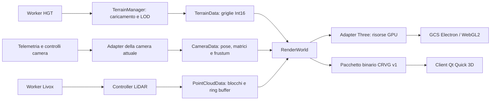

# Architettura del rendering — implementazione del 4 ottobre 2026

La GCS usa ora un modello di terreno, camera e LiDAR separato dalle risorse GPU.
Il backend Three/WebGL2 è operativo sul nuovo percorso. Il client Qt legge gli
stessi dati attraverso un pacchetto binario versionato. Questa modifica realizza
il confine necessario al porting del motore; la scena completa e la UI restano
ancora nel client Electron.



## Responsabilità applicate

`js/render` non importa Three, Electron o il DOM. Il contratto contiene numeri,
record semplici e typed array. `RenderState.js` crea l'istanza applicativa con
l'origine geografica configurata; gli altri moduli si possono usare e testare
senza avviare la GCS.

`TerrainManager.js` mantiene IO, worker, quote, selezione LOD, code e composizione
delle immagini. Non costruisce più mesh, shader, materiali, geometrie o texture
Three. I chunk attivi sono handle logici `{ id, uuid, data }`: `uuid` è mantenuto
per le code esistenti e coincide con l'identificativo stabile del chunk. `data`
contiene i metadati del caricamento, senza risorse GPU. `getActiveChunks()` ora
restituisce questi handle anziché mesh. Tutti i consumer interni sono aggiornati.

`js/engine/three/TerrainRenderer.js` possiede mesh, griglie condivise, array R16I,
strati liberi, materiali, texture BC1/Canvas e batch instanziati. Traduce le griglie
neutre nei medesimi shader esistenti e dispone le risorse alla rimozione. Il cambio
LOD conserva la mappa satellitare; il ripristino WebGL rialimenta gli array delle
quote. Gli identificativi consentono di aggiornare un chunk senza duplicarlo.

`PointCloudData` possiede i buffer storici e live del Livox, il limite dei punti,
l'epoch, l'istogramma e i cambi di intervallo. `LidarCloud.js` applica gli ancoraggi
geografici e l'assetto del veicolo. `PointCloudRenderer.js` crea le geometrie GPU
con riferimenti agli stessi buffer e invia solo gli intervalli modificati. Non
viene ricopiata l'intera nuvola a ogni frame.

`CameraData` conserva pose e matrici in buffer permanenti e calcola il frustum
numericamente. `CameraAdapter.js` acquisisce lo stato finale della camera attuale,
inclusi parent e view offset. `Scene3D.render()` esegue acquisizione e aggiornamento
del terreno prima dei passaggi di disegno. Il backend futuro riceve questi dati;
i controlli orbit/FPV usano ancora la camera Three durante questa fase.

## Convenzioni dei dati

| Elemento | Contratto |
| --- | --- |
| Mondo | Metri, sistema destrorso: X est, Y alto, Z sud; origine geografica esplicita |
| Camera | Forward -Z; quaternion `[x,y,z,w]` nel mondo; matrici column-major |
| Proiezione | Convenzione OpenGL: profondità clip `[-1,1]`; un adapter WebGPU deve convertirla |
| Altezza terreno | `Int16Array`, valori negativi e void preservati; una griglia per chunk attivo |
| Chunk | ID e revisione; larghezza; passo LOD; sorgente HGT; bounds geografici; `[x0,z0,dx,dz]`; sfera |
| Mappa BC1 | Dimensioni originali/padded, scala UV e mip con buffer `Uint8Array` |
| Fallback Canvas | Descrittore `canvas-reference`; la sorgente resta nel backend, senza readback CPU nel frame |
| Punti storici | Buffer locali X est, Y alto, Z sud, intensità e count; transform posizione/scala separato |
| Punti live | Buffer già convertito NED/FRD → assi della scena; transform con quaternion, birth, TTL e ring head |

Il consumer GPU copia le quote nello staging dell'array texture. Il modello
conserva anche il buffer del chunk per permettere un altro consumer o uno snapshot
senza ricampionare HGT. Il costo aggiuntivo è riportato in
`getMemoryStats().renderData.terrain.heightBytes`; viene liberato con il chunk.
Le typed array della nuvola sono invece condivise direttamente con gli attributi
Three, senza una seconda allocazione di staging nella logica applicativa.

## Pacchetto CRVG v1

`RenderPacket.js` espone `renderDocument`, `encodeRenderWorld` e `decodeRenderPacket`.
Il formato evita milioni di coordinate rappresentate come numeri JSON:

| Offset header | Contenuto |
| --- | --- |
| 0, 4 byte | ASCII `CRVG` |
| 4, uint32 LE | Versione 1 |
| 8, uint32 LE | Dimensione del manifest UTF-8 |
| 12, uint32 LE | Dimensione del payload binario |
| 16 | Manifest JSON; padding fino a multiplo di 8; payload |

Il manifest contiene dati semplici e riferimenti `{ "$buffer": indice }`.
La tabella allegati specifica tipo (`i16`, `u8`, `u16`, `u32`, `f32`, `f64`), offset
relativo al payload e byteLength. Numeri binari little-endian; offset allineati a
8 byte. Il decoder controlla versione, lunghezze, tipi, riferimenti e convenzioni.

L'export crea una copia degli allegati e non trasferisce né distacca i buffer
del renderer. Per i punti include solo gli intervalli attivi. È un'operazione
su richiesta: non viene serializzata la scena nel loop a 60 Hz. Le texture sono
escluse per default; `{ includeTextures: true }` include i mip BC1 quando presenti.
La sorgente Canvas non viene esportata come pixel: questo richiederebbe un percorso
dedicato sul worker. Il contratto è uno snapshot; delte binarie e trasporto live
verso un servizio nativo sono lavoro successivo.

Da DevTools, dopo l'avvio:

```js
const scene = await import('../js/engine/Scene3D.js');
scene.render();
const packet = scene.exportRenderPacket(); // ArrayBuffer CRVG
const world = scene.getRenderWorld();      // per ispezione, non da mutare dall'UI
```

Il test Electron salva uno snapshot in `docs/audits/2026-10-04/render-world.crvg`.
Il client nativo lo apre con:

```powershell
prototypes/qt-terrain/.venv/Scripts/python.exe prototypes/qt-terrain/run.py --packet docs/audits/2026-10-04/render-world.crvg --seconds 3 --smoke --output qt-packet-result.json
```

Qt converte i heightfield in geometrie indicizzate, con il medesimo ordine dei
triangoli e differenze one-sided sui bordi per le normali. Il client usa la pose
esportata e la matrice in [CustomCamera](https://doc.qt.io/qt-6/qml-qtquick3d-customcamera.html),
trasponendo l'ordine degli elementi per il costruttore QMatrix4x4. Consuma anche
i buffer LiDAR e i loro transform. La creazione di mesh CPU nel prototipo Python
serve a verificare il contratto; il porting prestazionale deve mantenere quote
e normali in shader GPU e gestire lo streaming fuori dalla GUI.

## Verifiche e limiti della migrazione

`npm run test:architecture` verifica modelli senza Three, quote e giunzioni fra
chunk, possesso dei buffer, blocchi/ring dei punti, epoch stale, round trip binario,
pacchetti troncati, culling contro il frustum Three, camera con parent/view offset,
quaternion YXZ, ripristino del contesto, LOD con mappa conservata, upload parziali
e smaltimento delle risorse. I test HGT e del backend continuano a passare.

`python prototypes/qt-terrain/test_render_packet.py` verifica il lettore nativo
senza installare Qt: snapshot generato dal produttore JavaScript, normali sui bordi e verso
dei triangoli, transform e TTL dei punti, versioni/riferimenti invalidi e
pacchetti troncati.
Il test genera il proprio fixture temporaneo e non dipende dai file di audit.

La verifica Electron usa profilo isolato, HGT locali e rete esterna disabilitata.
Controlla il contratto in uso, gli attributi GPU condivisi con il modello LiDAR,
il disegno schematico e i profili DPR. Lo snapshot viene poi renderizzato in Qt
con Direct3D 11 e camera/DPR corrispondenti. Evidenze in
`docs/audits/2026-10-04/render-architecture-validation.json` e
`qt-render-packet-smoke.*`. Le finestre delle prove sono nascoste/trasparenti:
queste verifiche non costituiscono un benchmark FPS.

La GCS completa usa ancora Three/WebGL2. Restano da portare: materiali TSL o
nativi, satellite/clipmap e outline Qt, linee/simboli/missione, modelli, acqua,
superfici/volumi ROS e UI/video. Le clipmap satellitari sono ancora un servizio
Three con una sola vista attiva. `Scene3D` conserva le API di compatibilità per
camera, renderer e scena necessarie ai consumer non ancora migrati. Nessun backend
WebGPU completo o frontend Qt completo è dichiarato disponibile.
