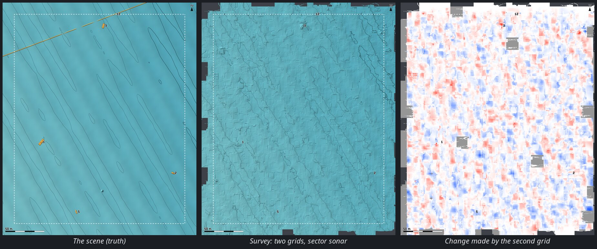

# ROS surface (rosbridge)

Terrain under an aircraft, a sea bed under a boat, the walls of an underwater cave: whatever a ROS
sensor measures, drawn live in the 3D view as an averaged mesh of grey lines over a transparent body
— not as a point cloud. The GCS connects to **rosbridge** on the vehicle's companion computer,
subscribes to one sensor topic, places every point with the MAVLink telemetry pose and averages them
into 30 cm cells.

```
  sensor ── ROS driver ── rosbridge_server ──── WebSocket ────▶ GCS worker ──▶ 3D view
  (LiDAR, sonar, echo sounder)     (CBOR, throttled)             (sample, place, average)   (changed tiles only)
  ArduPilot ── MAVLink ──────────────────────────────────────────▶ pose (absolute or relative)
```

Two independent links meet in the GCS: the autopilot does not need to know about ROS, and ROS does
not need to know about the autopilot. Nothing is installed on the vehicle besides rosbridge.

| | |
|---|---|
| [Quick start](#quick-start) | the five steps from a ROS sensor to a mesh on screen |
| [1. On the vehicle](#1-on-the-vehicle-rosbridge) | installing and starting rosbridge, the network, supported messages |
| [2. The ROS page](#2-setup--tools--ros-every-setting) | every setting on SETUP → TOOLS → ROS, with its default |
| [3. On the flight screen](#3-on-the-flight-screen-the-ros-strip) | the ROS strip, its three buttons and its colours |
| [4. Reading the status](#4-reading-the-status-and-troubleshooting) | the status lines, every state and what to do about it |
| [5. Worked examples](#5-worked-examples) | aerial LiDAR, SLAM map, echo sounder, survey sonar, ROV in a cave, sector-scanning sonar |
| [6. What happens to the points](#6-what-happens-to-the-points) | sampling, spikes, pose projection, placing, averaging, the mesh |
| [7. Caves](#7-caves-surfaces-3d) | the 3D signed-distance volume |
| [8. Absolute and relative](#8-absolute-and-relative-navigation) | with and without GPS |
| [9. Testing without a vehicle](#9-testing-without-a-vehicle) | the rosbridge emulator, the Lake Garda survey, measured accuracy |
| [10. Limits](#10-limits) | what the surface is not |

---

## Quick start

1. **On the companion computer**, start rosbridge (ROS 2: `ros2 launch rosbridge_server rosbridge_websocket_launch.xml`)
   and the sensor driver.
2. **In the GCS**, connect the vehicle as usual (MAVLink), so it has a pose.
3. Open **SETUP → TOOLS → ROS**, type the rosbridge address in **ROSBRIDGE URL** (`ws://<companion IP>:9090`)
   and tick **SURFACE FROM ROS**.
4. Pick the sensor topic in **TOPIC** (the list fills in once connected) and the **SENSOR** profile
   (*Aerial LiDAR* or *Sea bed*); check the **MOUNT** in the preview.
5. Go back to **FLIGHT DATA**: the **ROS** strip at the top shows **ACCUMULATING** and the surface
   grows under the vehicle as it moves.

The settings are remembered; the SURFACE FROM ROS tick is not — like the LiDAR, a ROS link is
started on purpose, each session.

---

## 1. On the vehicle: rosbridge

### Install and start

rosbridge is the standard ROS package that exposes topics over a WebSocket. The launch file also
starts **rosapi**, which the GCS uses to list the topics.

| | Install | Start |
|---|---|---|
| ROS 2 (Humble, Jazzy, …) | `sudo apt install ros-$ROS_DISTRO-rosbridge-suite` | `ros2 launch rosbridge_server rosbridge_websocket_launch.xml` |
| ROS 1 (Noetic) | `sudo apt install ros-noetic-rosbridge-server` | `roslaunch rosbridge_server rosbridge_websocket.launch` |

It listens on **TCP port 9090** (`port:=…` changes it). Start it at boot together with the sensor
driver (a systemd unit or your launch file), so it is there whenever the vehicle is powered.

### Network

The GCS PC must reach the companion computer over IP: Wi-Fi, an Ethernet radio bridge (Microhard,
Doodle Labs, Silvus, Ubiquiti), a tether, or a VPN over a cellular link. Open TCP 9090 in the
companion's firewall. The address you type is the companion's IP as seen from the GCS:
`ws://192.168.1.20:9090`. `wss://` works for a rosbridge behind TLS.

A point cloud is heavy: rosbridge sends whole messages, and the GCS samples them only after they have
crossed the link. On a narrow link lower **MAX RATE**, or downsample on the vehicle (`pcl_ros`
VoxelGrid, the driver's own decimation) — see [Limits](#10-limits).

### Supported messages

| Message | Typical sensors | What is read |
|---------|-----------------|--------------|
| `sensor_msgs/PointCloud2` | 3D LiDAR (`livox_ros_driver2`, Velodyne, Ouster, Hesai), multibeam or profiling sonar, a SLAM map | the `x`, `y`, `z` fields (any numeric type), `header.frame_id`, `header.stamp` |
| `sensor_msgs/LaserScan` | 2D scanner, push-broom LiDAR, a multibeam swath published as a scan, a sector-scanning sonar | `ranges`, `angle_min`, `angle_increment`, `range_min/max`, `time_increment` (each beam at its own time) |
| `sensor_msgs/Range` | single-beam echo sounder, altimeter, a downward rangefinder | `range`, `field_of_view`, `min/max_range` |

ROS 1 and ROS 2 type names (`sensor_msgs/msg/PointCloud2`) are both recognised. Points that are NaN,
infinite or exactly (0, 0, 0) — the "no return" value of many drivers — are dropped.

Sensors with their own message types — the Blue Robotics Ping360 and Ping1D
(`bluerobotics_ping_msgs`), a sonar SDK's own messages — need a small node on the companion that
republishes them as one of the three types above: a Ping1D distance as a `Range` (in metres, with the
beam width as `field_of_view`), a multibeam ping as a `LaserScan` or a `PointCloud2` in the sensor's
frame.

A **mechanical sector-scanning sonar** (Ping360, Imagenex 881, Tritech Micron) measures one beam per
ping, stepping its head between pings: a 120° sector takes 4–6 s, and a boat moves metres in it. Its
node should detect the bottom in each ping's echo and publish the pings as a `LaserScan` every second
or so, never across a turn of the head: `angle_min` the first ping's head angle, `angle_increment`
the step (negative while the head sweeps back), **`time_increment` the time from one ping to the
next** and `header.stamp` the first ping's time. The GCS then places every beam with the vehicle's
pose at its own time ([§6](#6-what-happens-to-the-points)); without `time_increment` the whole
message gets one pose, and a wreck under a boat at 2 m/s comes out smeared along the track
([§9](#9-testing-without-a-vehicle)).

---

## 2. SETUP → TOOLS → ROS: every setting

The page has two panels: **ROS · ROSBRIDGE** (the link and the topic) and **MOUNT & MESH** (where the
sensor sits and how the surface is built). Every change applies at once, also while connected. A
green dot beside **ROS** in the SETUP menu means rosbridge is connected.

### ROS · ROSBRIDGE

| Setting | Default | |
|---------|---------|---|
| **SURFACE FROM ROS** | off | Connects to rosbridge and starts building the surface; unticking disconnects, hides the strip and clears the surface. Not remembered between sessions. |
| **ROSBRIDGE URL** | `ws://127.0.0.1:9090` | Must start with `ws://` or `wss://`. Changing it while connected reconnects. If rosbridge is not there yet the GCS retries every 2 s. |
| **TRANSPORT** | CBOR | **CBOR** sends the binary point arrays as they are; **JSON** inflates them by a third (base64). Use JSON only for an old rosbridge without CBOR. |
| **TOPIC** | — | The topics rosapi lists, filtered to the three supported types, as `name · type`. **REFRESH** asks rosapi again (a driver started after the GCS connected). A saved topic nobody publishes right now stays selected, marked *(not published now)*: rosbridge subscribes ahead of the publisher. Changing topic clears the surface. |
| **SENSOR** | Aerial LiDAR | A profile that fills in the usual values (below). Choose it first, then adjust. |
| **SURFACES** | Floor only | *Floor only (terrain, sea bed)*: one height per cell. *3D: caves, shafts, overhangs*: a signed-distance volume ([§7](#7-caves-surfaces-3d)). |
| **POINTS FRAME** | Auto | *Auto* decides from `header.frame_id`: `map`, `odom`, `world`, `earth`, `local_origin` (optionally with `_enu`, or `_ned` for NED) are **world frames**, everything else is the **sensor's own frame**. *Sensor* and *World* force one or the other. |
| **MAX RATE (Hz)** | 10 (profile) | rosbridge sends at most this many messages a second, only the newest (`throttle_rate`, `queue_length` 1): a slow link never builds a backlog. |
| **POINTS PER MESSAGE** | 5 000 (aerial) / 1 000 (sea bed) | From each message at most this many points are sampled with a uniform stride from a random start; the rest are not used. 30 cm cells need about 10 000 points a second to fill a 100 m swath at 8 m/s. Up to 20 000. |
| **CLEAR SURFACE** | | Drops the surface; it starts again from the next message. The same as CLEAR on the strip. |
| **STATUS** | | The live status lines — see [§4](#4-reading-the-status-and-troubleshooting). |

What each **SENSOR** profile fills in:

| | Mount (roll, pitch, yaw) | Range window | Max rate | Points per message | Fill holes up to |
|---|---|---|---|---|---|
| **Aerial LiDAR** · terrain under the aircraft | 180, 0, 0 (Livox inverted under the belly) | 2.5 – 100 m | 10 Hz | 5 000 | 4 cells |
| **Sea bed** · echo sounder or sonar on a boat / ROV | 0, −90, 0 (looking down) | 0.5 – 100 m | 10 Hz | 1 000 | 4 cells |
| **Sector sonar** · mechanical scanning head, one beam per ping | 0, −90, 0 (head down, sweeping across the track) | 0.75 – 100 m | 10 Hz | 1 000 | 8 m |

### MOUNT & MESH

| Setting | Default | |
|---------|---------|---|
| **MOUNT ATTITUDE VS IMU (ROLL / PITCH / YAW °)** | from the profile | ZYX Euler angles of the sensor frame relative to the vehicle body. The sensor frame is the ROS one (REP-103: x forward, y left, z up; a Range and a LaserScan measure along x); the body is the autopilot's (FRD: x forward, y right, z down). **Preset…** fills in the common cases: *Looking down (x down)* 0, −90, 0 for an echo sounder, altimeter or push-broom scanner; *Inverted under the belly* 180, 0, 0 for a Livox Mid-360; *Upright, x forward* 0, 0, 0; *Upright, nose-down 45°* 0, −45, 0. |
| **LEVER ARM IMU → SENSOR (X FWD / Y RIGHT / Z DOWN, m)** | 0, 0, 0 | Where the sensor's origin is from the autopilot's IMU, in the body frame. On a boat, **Z** is the transducer's draft below the IMU (positive down). |
| **MOUNT PREVIEW** | | Draws the result as you type: the vehicle (a triangle, nose forward, fin on top), the sensor at its lever arm with its axes (X red, Y green, Z blue) and the zone it collects from, turned by the mount — a Range's cone, a LaserScan's fan, a cloud's directions over the last 10 s (also on the bench, with no vehicle connected). It uses the same rotation the points are placed with: if the zone points the wrong way here, the surface will be wrong. |
| **RANGE WINDOW (m)** | from the profile | Returns closer than the minimum (the airframe, the hull, the landing gear) or farther than the maximum are dropped, in the sensor frame, before anything else. |
| **SPIKE FILTER** | Spikes dropped | Along an ordered scan (a sonar's beams, a LaserScan's sweep, a lidar's rings) a return far off its neighbours is dropped: aeration under the hull, a fish, a particle. *Every return* turns it off. Never applied to a Range or to a cloud with no order. Details in [§6](#6-what-happens-to-the-points). |
| **TIME OF THE POINTS** | Arrival − lag | When the points were measured, for the pose lookup. *Arrival − lag*: the time they reached the GCS, minus LAG. *header.stamp + lag (clocks synced)*: the message's own stamp, when the companion's clock is synced with the GCS PC (chrony, NTP, GPS time); a stamp more than 2 s off this clock is not trusted, and the status line says so. |
| **LAG (ms)** | 0 | With *Arrival*: how much later than the telemetry the points reach the GCS (positive: points later). With *Stamp*: how late the telemetry reaches the GCS. Tune it as in the [aerial example](#a-aerial-lidar-terrain-under-a-drone). −2000 to 2000. |
| **VERTICAL REFERENCE** | Vehicle altitude (EKF) | The height the sensor is placed at (less the lever arm). *Vehicle altitude*: the autopilot's. *Water surface at home · a boat*: the altitude of home — where the boat was armed, on the water — whatever the EKF says later: a boat is always at the surface, while its EKF altitude drifts with the barometer, decimetres in a survey and metres over a day, and the bed would rise or sink with it from lane to lane. The waves' heave is not followed (it averages out). Not for a ROV or an aircraft. |
| **MIN CELL (m)** | 0.3 | The finest cell: the mesh is this fine where the data allow. Changing it clears the surface. |
| **MIN SAMPLES** | 1 | Samples a cell needs to be drawn at its own size; with fewer, the mesh there is drawn coarser (60 cm, 1.2 m, 2.4 m, 4.8 m). Raise it for a cleaner, coarser mesh; lower it (down to 0.3) to see every cell touched once. |
| **FILL HOLES UP TO** | 4 cells (profile) | Empty cells between data are interpolated from the coarser cells around them, up to this size (at most 16 cells: 4.8 m at 30 cm, 8 m at 50 cm) — never past the edge of the data or across a height jump. *4 cells* (1.2 m at 30 cm) for sensors that cover their swath; **8 m** for those that sample in lines — a sector sonar's sweeps 5–10 m apart, an echo sounder's lanes. The coverage of a planned area is counted in blocks of this size: the area the mesh is drawn over. |
| **MEMORY (samples)** | 20 | A cell averages at most this many samples (messages), then follows a moving average: lower follows a changing scene faster, higher averages more noise away. |
| **MAX TILES** | 2 048 | Tiles of 30 × 30 cells kept; past this, the farthest from the vehicle are dropped. 2 048 tiles ≈ 16 ha at 30 cm. |
| **TRIANGLE FILL OPACITY (%)** | 10 | How opaque the triangles between the lines are; 0 = grey lines only. Up to 60. |
| **DRAW THROUGH THE TERRAIN MESH** | on | The surface is drawn over the elevation model even where it is under it: SRTM is ±5 m, and a lake's flat surface would hide the sea bed. Untick to let the terrain hide it. |

---

## 3. On the flight screen: the ROS strip

While **SURFACE FROM ROS** is ticked a strip appears at the top of the FLIGHT DATA screen:

```
 ● ROS  ACCUMULATING   12 480 cells · 30 cm · 4–31 m · 62 % of the area   [ DIST ] [ VIEW ON ] [ CLEAR ]
```

| Part | |
|------|---|
| **LED** | green: accumulating; orange blinking: connecting or no rosbridge; orange: connected but not accumulating (no topic, no data, no pose…) |
| **State** | the same state as the status line — see [§4](#4-reading-the-status-and-troubleshooting) |
| **Counter** | cells filled and the cell size (or, in 3D mode, triangles); with DIST the distance range of the colours; with ROUGH the departures read blue (the average) and full red; with a survey area planned, how much of it is covered |
| **GRAY / DIST / ROUGH** | grey lines, or a solid surface coloured by distance or by roughness, cycling on each click (remembered) |
| **VIEW ON / OFF** | hides or shows the surface; it **keeps accumulating** while hidden (remembered) |
| **CLEAR** | drops the surface and starts again |

The three colours:

- **GRAY**: grey lines over a transparent body — the default, the least distracting.
- **DIST**: a solid surface, shaded from the north-west, no lines: red → blue by distance from the
  vehicle, red at the nearest surface, blue at NEAR + max(20 m, 2 × NEAR); the strip shows the range
  in metres. Reads as a depth or height map around the vehicle.
- **ROUGH**: a solid surface, shaded, no lines: how far the surface departs from its local plane (the
  RMS distance of the heights within 1.5 m from the plane that fits them best), against what is usual
  for this surface — **blue** as rough as it is on average or less, **red** from three standard
  deviations above the average (and at least 5 cm above it); the strip shows both, e.g. *blue ≤ 2 cm ·
  red ≥ 9 cm off-plane*. A bed's own texture (ripples, the sonar's noise) stays blue; rocks, a wreck, a
  scarp, pockmarks stand out red — and so does a bad average (a wrong mount or lag shows as red
  streaks along the track). In 3D mode, where a wall has no height, it is how much the faces around
  each vertex disagree in direction, on the same scale.

The solid surfaces are drawn through the terrain too (DRAW THROUGH THE TERRAIN MESH) and hide their
own far side — a wreck's back wall is behind its front — while the vehicle stays in front of them.

The HUD also announces each change: *ROS: connecting to …*, *ROS: averaging /topic*, *ROS: no
rosbridge at …*, and a warning when accumulation stops.

---

## 4. Reading the status and troubleshooting

The **STATUS** box on the ROS page has up to seven lines:

```
CONNECTED ws://192.168.1.20:9090
/livox/lidar · PointCloud2 · frame livox_frame → SENSOR · placed with the telemetry pose
10 msg/s · 200,000 pts/s in · 50,000 sampled · 48,900 averaged · 1,100 spikes dropped (2.2 %)
surface 214 / 2,048 tiles of 30×30 · cell 0.3 m · 96,120 cells (8,651 m²)
planned area 1: 0.12 km² · 7.2 % covered
drawn 9 / 9 blocks · 172,000 triangles · resolution 30 cm 81% · 60 cm 15% · 120 cm 4%
ACCUMULATING · pose absolute (GPS)
```

1. the link and the URL;
2. the topic, its type, its `frame_id` and how it is treated (sensor frame or world ENU / NED);
3. messages and points a second: received, sampled, averaged, and the spikes dropped (or *spike
   filter idle: the scan has no order*);
4. the surface: tiles used of MAX TILES, cell size, cells and area filled (3D mode: chunks and triangles);
5. one line per **area scan** in the flight plan: its size and how much of it the surface covers,
   counted in blocks of FILL HOLES UP TO (green above 90 %);
6. what is drawn: blocks, triangles and how much of the mesh is at each resolution;
7. the state, absolute or relative pose, and the autopilot clock rate when it is not 1 (a SITL
   speed-up).

Warnings in orange appear in between: messages dropped for lack of a pose or a home, a
`header.stamp` that is not synced with this clock. A message with no pose says why: *points 1,200 ms
after the newest attitude* — the telemetry stopped or runs more than 0.5 s behind the points (the
link; LAG); *… before it, N ms after the oldest kept* — the points are older than the telemetry the
GCS keeps (LAG, or a stamp from another clock). The GCS keeps working minimized, behind another
window or with the screen off.

| State | Means | What to do |
|-------|-------|------------|
| **CONNECTING** | opening the WebSocket | wait; it retries every 2 s |
| **NO ROSBRIDGE** | the address does not answer | check the URL and port, that rosbridge runs (`ros2 node list` shows `/rosbridge_websocket`), the network (ping the companion) and the firewall (TCP 9090) |
| `rosapi: … is rosapi running` (error line) | connected but the topic list failed | start rosbridge with the launch file, which starts rosapi too, not the bare node |
| **NO TOPIC** | connected, no topic chosen (or of an unsupported type) | choose one in TOPIC; if the list is empty, check the driver publishes (`ros2 topic list -t`) and press REFRESH |
| **NO DATA** | no message for 3 s on the chosen topic | the driver stopped or publishes on another name; `ros2 topic hz /topic` on the companion |
| **NO VEHICLE** | no vehicle is connected (the demo flight is running) | connect the vehicle over MAVLink: points are placed with its pose |
| **NO POSITION** | the vehicle has no position yet | wait for a GPS fix, or switch to the relative navigation mode for a vehicle without GPS ([§8](#8-absolute-and-relative-navigation)) |
| **NO HOME (world frame)** | world-frame points (`map`, `odom`) but no home known | wait for the home position (HOME_POSITION after arming / the first fix), or use a sensor-frame topic |
| **NO HOME (water surface)** | VERTICAL REFERENCE is the water surface, and no home is known yet | wait for the home position, or choose *Vehicle altitude* |
| **EMPTY MESSAGES** | messages arrive with no points | the driver publishes empty clouds (sensor not spinning, filtered out) |
| **NO VALID POINTS** | every point was outside the range window, NaN or (0, 0, 0) | widen the RANGE WINDOW; check the cloud's units are metres |
| **FRAME CHANGED · CLEAR** | the navigation mode changed under the surface | press CLEAR (it clears by itself on a new connection or a mode switch) |
| **ACCUMULATING** | everything works | — |

When the surface looks wrong rather than absent:

| Symptom | Likely cause |
|---------|--------------|
| The surface is tilted, upside down, or appears above the vehicle | wrong MOUNT: compare the zone in MOUNT PREVIEW with where the sensor really looks |
| Two sheets, doubled walls, steps along every slope when the vehicle turns | wrong LAG (or a wrong yaw in the mount); low telemetry rates — raise `SR_EXTRA1` and `SR_POSITION` to 10 Hz or more in [MAVLink stream rates](sys-config.md#mavlink-stream-rates) |
| The surface is offset by a constant distance | wrong LEVER ARM, or (world frame) a map frame not anchored at the EKF origin |
| A boat's bed steps up or down from one lane to the next, or reads too deep or too shallow overall | the EKF altitude drifting with the barometer: VERTICAL REFERENCE *Water surface at home* |
| A sector sonar draws zig-zag lines with holes between them | FILL HOLES UP TO 8 m (the Sector sonar profile), or drive slower |
| Shallow bumps under the track of a boat | aeration: leave the SPIKE FILTER on, raise the minimum range |
| Very sparse, coarse mesh | too few points: raise POINTS PER MESSAGE or MAX RATE, or lower MIN SAMPLES |
| The GCS slows down | lower POINTS PER MESSAGE, MAX TILES, or use 30 FPS (SYS CONFIG) |

---

## 5. Worked examples

### A. Aerial LiDAR: terrain under a drone

A Livox Mid-360 inverted under the belly, `livox_ros_driver2` publishing `/livox/lidar`
(PointCloud2, frame `livox_frame`).

1. SENSOR **Aerial LiDAR** (mount 180, 0, 0, range 2.5–100 m, 10 Hz, 5 000 points), SURFACES **Floor
   only**, POINTS FRAME **Auto** (the status shows `livox_frame → SENSOR`).
2. LEVER ARM: measure the sensor's optical centre from the autopilot, e.g. 0.05 m forward, 0, 0.12 m
   down.
3. RANGE WINDOW: raise the minimum until the landing gear and the propeller guards no longer show as a
   blob under the vehicle.
4. In SYS CONFIG → MAVLINK STREAM RATES set POSITION and EXTRA1 to 10 Hz and write them.
5. Fly: hover 10–20 m over a slope or next to a building and yaw slowly. If the slope doubles or
   steps as the vehicle turns, change LAG in steps of 20–50 ms until it stays one sheet — 0–50 ms on a
   direct IP link, 100–300 ms through a slower radio for the telemetry.

The [LiDAR chapter](LIDAR.md) covers the same sensor read directly (no ROS) as a point cloud; this
page averages it into a surface instead.

### B. A SLAM map in a world frame

FAST-LIO, Point-LIO or a MAVROS pipeline publish an already georeferenced cloud (`/cloud_registered`)
in a world frame. If its `frame_id` is `map`, `odom` or `world`, *Auto* treats it as a world frame:
points are placed from **home** (absolute mode) or from the local zero (relative mode), with no mount
or lag. A frame with another name (FAST-LIO's `camera_init`) needs POINTS FRAME **World**.

This only lines up when the world frame is ENU (x east, y north, z up) with its origin at the EKF
origin, as MAVROS publishes it. A SLAM that started elsewhere or with another heading does not —
subscribe to its sensor-frame topic instead and let the GCS place it.

### C. Single-beam echo sounder on a boat

A Ping1D (or any echo sounder) republished as `sensor_msgs/Range` on `/ping1d/range`.

1. SENSOR **Sea bed** (mount 0, −90, 0 — x looking down; range 0.5–100 m), SURFACES **Floor only**.
2. LEVER ARM **Z** = the transducer's depth below the autopilot (e.g. 0.3 m), X/Y its position.
3. A single beam fills one line of cells along the track: drive lanes close together (a few metres
   apart) and raise **MIN CELL** to 1–2 m, so neighbouring lanes join into a surface.
4. The status shows the beam as *Range · 25° cone along X* in the preview (from `field_of_view`).

### D. Multibeam or imaging sonar on a survey boat

1. Plan the survey in FLIGHT PLAN as an **Area scan** with *Lane spacing: From mapping sensor* —
   aperture, range, design depth, side overlap ([mission planning](mission-planning.md#sonar-and-lidar-surveys)).
2. ROS page: the sonar topic (PointCloud2 or LaserScan), SENSOR **Sea bed**, mount **0, −90, 0** if
   the fan is published with x along the beam axis looking down; check the fan in MOUNT PREVIEW lies
   **across** the hull.
3. Leave the **SPIKE FILTER** on: under a hull in a chop the aeration returns at 0.5–4.5 m outnumber
   the bed's in the cells under the track, and without the filter the bed there comes out metres too
   shallow.
4. Use **header.stamp** if the companion runs chrony against the GCS or GPS time — sonar pings are
   stamped at transmission, and a stamp beats arrival time on a variable link.
5. During the survey the strip shows *… % of the area*, and the status one line per planned area:
   the lanes still to fill are where the coverage stays below 100 %. **ROUGH** colour shows rocks,
   wrecks and scarps on the bed.

### E. ROV in a cave or a shaft

1. SURFACES **3D: caves, shafts, overhangs**, a profiling sonar (e.g. a 360° fan across the vehicle) in
   the sensor frame.
2. Without GPS under water, switch SYS CONFIG → NAVIGATION to **Relative**: the points are placed with
   the vehicle's `LOCAL_POSITION_NED` (a DVL or USBL fused by the EKF) — see
   [navigation without GPS](3D-NAVIGATION.md#5-navigation-without-gps).
3. Move or sweep: a surface needs the sensor to move; two fans from one place have no area.

### F. Sector-scanning sonar on a survey boat

A Ping360-class head on a pole under the boat, mounted with its rotation axis along the keel so it
sweeps across the track, republished as `LaserScan`s with `time_increment` ([§1](#supported-messages)).

1. ROS page: the sonar's topic, SENSOR **Sector sonar** (mount 0, −90, 0: the beam's x looking down,
   the sweep across the hull — check the fan in MOUNT PREVIEW), LEVER ARM **Z** the head's depth
   below the autopilot. The status shows *beams measured over 1.0 s a message (time_increment): each
   placed with the pose of its own time*; if it does not, the node is not filling `time_increment`.
2. VERTICAL REFERENCE **Water surface at home**: the bed's depths then come from the water, not
   from the EKF altitude's barometric drift. RANGE WINDOW: raise the minimum above the aeration under
   the boat (3–5 m) and below the shallowest bed — the spike filter drops single bubbles, not a run of
   them in a chop.
3. MIN CELL **0.5 m**: one beam per ping fills one cell, and 30 cm cells stay sparse. The profile
   sets FILL HOLES UP TO **8 m**, so the sweeps join into one surface; at the default 4 cells the
   mesh shows the sweeps as separate zig-zag lines, and the coverage counts only the cells they touch.
4. Plan the survey as an **Area scan**, *From mapping sensor*, with the sector as the swath angle and
   the range set on the sonar; drive slowly — a sweep every 4–6 s means a profile every 5–7 m at
   1–1.5 m/s, and objects smaller than that can fall between two sweeps.
5. The bottom of a sector sonar is where the echo crosses a threshold, on the beam's axis: a hard
   object comes out wider by part of the beam's footprint, and the bed at the edges of the sector reads
   a little shallow. Overlap the lanes so every object is seen from near the middle of a sector by one
   of them.

---

## 6. What happens to the points

1. **Sampling.** The worker thread decodes each message (CBOR byte strings and typed arrays, or JSON
   base64) and keeps at most POINTS PER MESSAGE of them. Nothing of this reaches the render thread.
2. **Spikes.** Points in the order the sensor sent them — a sonar's beams across its swath, a
   LaserScan's sweep, a lidar's rings — form a profile: a real surface is continuous from one beam to
   the next but at a few edges, while aeration under the hull, a fish or a particle is a beam or a few
   far off their neighbours. A point more than max(0.5 m, 8 % of the range) from the median of the 9
   points around it is dropped; the median keeps edges (a wall, a wreck's side). A cloud without
   order (or sampled too sparsely to keep it) is left alone. The status line shows how many are
   dropped. Under a survey boat in a chop, aeration returns at 0.5–4.5 m land in the cells under the
   track, where they outnumber the bed's: without the filter the bed there came out 10 m too shallow.
3. **Pose at the points' time.** The pose is the one the 3D view draws the vehicle at — absolute
   (GPS) or relative (SYS CONFIG → NAVIGATION). A `LaserScan` with a `time_increment` is placed
   beam by beam, each at its own time (runs of beams within 5 ms share one pose): the first beam at
   `header.stamp`, or — with arrival time — the message's span before it arrived, since a message
   arrives after its last beam. The sensor's seconds are taken as the autopilot's (the same on a
   vehicle and in a simulation). Every ATTITUDE and GLOBAL_POSITION_INT reaches the
   worker with its arrival time and the autopilot's `time_boot_ms`; the sample just before the points
   is **projected** to their time: attitude with the gyro rates (Euler kinematics), position with the
   velocity. Without this, a copter yawing at 90°/s with an attitude 50 ms old puts a return 80 m away
   6 m off, and every slope the scan crosses grows spikes. The projection runs on the autopilot's
   clock, measured from `time_boot_ms` against arrival: 1 on a vehicle, the speed-up in a SITL (shown
   on the status line), where 50 ms here are a second of rolling in the waves. The telemetry samples
   themselves are timed by the autopilot's clock (`time_boot_ms`) mapped onto the GCS's along the
   least delayed of them, not by their arrival: anything that holds the GCS's main thread for a
   moment (a long frame, a garbage collection) delays and bunches the telemetry, never the points'
   poses. A message whose points are newer than the newest telemetry waits for it, up to 1.5 s.
4. **Placing.** Sensor frame → mount + lever arm → body → NED → ENU from an anchor (the first pose);
   world frames from home (absolute) or from the local zero (relative).
5. **Averaging.** Each message gives each 30 cm cell it touches one sample — the mean of its points
   there, weighted by how many (1 point = 1/3 of a sample) — and a cell keeps a running mean of at
   most MEMORY samples. Cells live in tiles of 30 × 30, made only where data arrive; past MAX TILES
   the farthest from the vehicle are dropped.
6. **Adaptive mesh.** 30 cm is the finest the mesh gets: each cell is drawn at the finest of 30 cm,
   60 cm, 1.2, 2.4 or 4.8 m that has MIN SAMPLES, and the lines at that spacing. Holes up to FILL
   HOLES UP TO (1.2 m at 30 cm by default) are interpolated, edges are not extended, and nothing is
   averaged or joined across a height jump (a cliff, a wall).

The renderer keeps the heights in GPU textures (blocks of 8 × 8 tiles), builds the triangles in the
vertex shader, draws the lines in the fragment shader (they fade where cells get smaller than a few
pixels; tile edges every 9 m stay) and coarsens far blocks. Only the tiles that changed travel from
the worker, at most four times a second. Points are not kept: the surface cannot be exported as a
point cloud (the [LiDAR](LIDAR.md) page saves `.ply` for the Livox read directly).

## 7. Caves (SURFACES: 3D)

A height per cell holds one surface: right for terrain, wrong in a shaft, a cave or under an overhang,
where floor, walls and ceiling share columns. In 3D mode the returns are fused into a volume of 30 cm
voxels holding a truncated signed distance to the rock along each ray (positive in the water,
negative behind the rock, averaged over MEMORY samples), and meshed where it changes sign (surface
nets). Every wall comes out with its own orientation. The volume is kept in chunks of 16³ voxels;
only the chunks that changed are meshed again and sent. A surface needs the sensor to move or sweep:
two fans from one place have no area. 3D mode has no levels of detail: it is meant for the scale of a
cave, not of a survey.

## 8. Absolute and relative navigation

| | Absolute (GPS) | Relative (no GPS) |
|---|---|---|
| Sensor-frame points | placed with GLOBAL_POSITION_INT + ATTITUDE | placed with LOCAL_POSITION_NED (DVL, USBL, visual odometry in the EKF) or the GCS dead reckoning |
| World-frame points (`map`, `odom`) | from home (a sub: its surface) | from the local zero |
| Switching mode, a vehicle connecting | the surface starts again: its frame is gone | |

In relative mode the mesh is only as good as the local position: with a DVL or USBL it holds;
dead-reckoning on a sub's EKF velocity drifts with it. Coverage of planned areas is measured in
absolute mode only (a relative frame has no place on the map).

## 9. Testing without a vehicle

These scripts run from a source checkout (`git clone`, `npm install` — see
[Getting started](getting-started.md#install)):

```
node scripts/test-ros-surface.js     # decoding, frames, mounts, projection, cells; rosbridge end to end
node scripts/test-ros-cave.js        # a ROV down the cave: mounting check and 3D mesh accuracy
node scripts/test-ros-sector.js      # the GCS's worker on a moving boat: a sector sonar with and without time_increment
node scripts/rosbridge-sim.js --scene terrain|seabed|cave|garda|garda-complex [--ros1] [--pose e,n,up,yaw]
node scripts/garda-map.js [--scene garda|garda-complex] [--area e0,n0,e1,n1] [--res m] [--tiles surface.json [--diff | --against earlier.json]] --out map.png
```

(On Node 20 the tests restart themselves with `--experimental-websocket`, which roslib needs.)

`rosbridge-sim.js` speaks the rosbridge protocol (JSON and CBOR, rosapi, throttling) and publishes
`/livox/lidar`, `/cloud_registered` (`map`), `/scan`, `/sonar/multibeam`, `/ping1d/range`,
`/sonar/profiler` (dual 360° fan), `/sonar/imaging` (an imaging sonar looking down: 256 beams over
90° across the track, 90 m range, a 10° vertical aperture, with aeration that grows with the hull's
motion, fish, dropouts and range noise) and `/sonar/sector` (below), ray-cast from SITL's true pose
(SIMSTATE / SIM_STATE on TCP 5762, also without GPS) against a known scene: hills with rocks, a 0.6 m
slab and a ditch; a lake bed with a wreck and rocks; a cave of 3 m shafts and passages down to 30 m;
**garda**, 5 km² of the southern basin of Lake Garda (2.5 × 2 km from 45.4960 N, 10.6490 E), 6 to
74 m deep. Other options: `--port` (9090), `--mav` (`tcp:127.0.0.1:5762`), `--lidar-mount`,
`--down-mount`, `--profiler-mount`, `--lever`, `--lidar-points`, `--sonar-aperture`, `--sonar-beams`,
`--sonar-range`, `--sonar-rate`, `--sonar-clean` (no disturbances).

**`/sonar/sector`** is a mechanical sector-scanning sonar, head down, sweeping across the track: one
beam per ping, the head stepping `--sector-step` (1.8°) back and forth over `--sector-aperture`
(120°), a ping every 2 × `--sector-range` (40 m) / 1 480 m/s + 12 ms — 15 pings a second, a sweep
every 4.4 s. The bottom is where a quarter of the echo's energy is back, from rays across the beam
(`--sector-beam` 2° by `--sector-fan` 2°; 25° for a Ping360) weighted by its pattern, put on the beam's
axis; with aeration, fish, dropouts, 3 cm + 0.2 % of range noise and 1 200 range bins. Pings go out
as `LaserScan`s of `--sector-batch` (1 s) of the sweep with `time_increment` (`--sector-untimed`
leaves it 0), the head stepping on the SITL's clock — read from ATTITUDE.time_boot_ms — so a survey
run at ×5 is sampled along the track as at ×1. Mount `--sector-mount` (0, −90, 0).

**The garda scene** is an approximation of the bed, not survey data: the slope from the western
shallows (10 m) into the basin (74 m), a moraine ridge 14 m high with boulders on it, an old
channel, a rock shoal coming up to 6 m, a slump on the slope into the basin (its scar and its lobe),
glacial erratics on the plain, sand ripples in the shallows, pockmarks in the mud, natural relief at
every scale from 8 to 420 m, and a 28 m wreck. On the plain in the south-west, 11–17 m deep, lie
the **objects** — sharp-edged boxes and cylinders, ray-cast exactly, so a sonar sees their walls,
their shadows and the widening its beam gives them:

| # | Object | Depth | Proud of the bed | Position |
|---|--------|-------|------------------|----------|
| 1 | Motorboat wreck, 9 m, with its wheelhouse | 12.3 m | 2.6 m | 45.498744 N 10.652262 E |
| 2 | Car | 14.6 m | 1.3 m | 45.498384 N 10.654437 E |
| 3 | 20 ft container | 13.8 m | 2.4 m | 45.500094 N 10.653286 E |
| 4 | Light aircraft (11 m wing span) | 16.0 m | 2.2 m | 45.499734 N 10.655205 E |
| 5 | Upturned rowing boat | 12.7 m | 0.5 m | 45.497934 N 10.652838 E |
| 6 | Artificial reef, nine 2 m cubes | 14.8 m | 1.8 m | 45.498114 N 10.655461 E |
| 7–10 | Four mooring blocks, 20 m apart | 13.9–15.4 m | 0.8 m | from 45.500991 N 10.653437 E |
| 11 | Oil drums, twelve upright and two lying | 13.4 m | 1.2 m | 45.500724 N 10.651623 E |
| 12 | Pipeline Ø 0.8 m, 425 m long, partly in the sediment | 11.7–17 m | 0.5 m | across the field, WSW–ENE |

**garda-complex** is the same lake and the same objects with the ground around them made hard to
survey: a rocky ridge 3–4 m high running east–west between the wreck and the container, its crest
uneven and a gully cut through it; a scarp where the bed steps 2.6 m down to the east (the car now
lies 17 m deep below it); a rock pinnacle rising 5.5 m; a field of boulders up to 1.8 m south of the
wreck; sand waves 0.8 m high and 14 m apart in the north-east, which the pipeline spans; three
pockmarks with raised rims; a channel through the ridge's west end; and a 2–4 m rock texture on the
rocky parts. Its slopes stay within what the emulator's ray-casting handles exactly (checked against
a 2 cm march in `test-ros-surface.js`).

`garda-map.js` draws the scene as a bathymetric map — depth colours, hill shading, isobaths, the
objects numbered as above (the legend on its output), scale and north — or, with `--tiles`, a
surveyed surface in the same frame (the ROS surface as the GCS holds it, `getRosSurface()` saved as
JSON), or with `--diff` the survey's difference from the scene.

Step by step, with the GCS's own simulator:

1. SETUP → TOOLS → SIMULATION: launch a vehicle ([simulator](simulator.md)) — a Copter for
   `terrain`, the **Boat** for `seabed` or `garda`, a ROV for `cave`.
2. In a terminal: `node scripts/rosbridge-sim.js --scene garda` **before the vehicle moves** (the
   scene is anchored at home).
3. ROS page: URL `ws://127.0.0.1:9090`, tick SURFACE FROM ROS, pick a topic — mounts as the emulator
   uses them: `/livox/lidar` 180, 0, 0; `/ping1d/range`, `/scan`, `/sonar/multibeam` and
   `/sonar/imaging` 0, −90, 0; `/sonar/profiler` 0, 0, 0.
4. Arm and fly or drive: the surface should match the scene.

A survey of the garda scene: the **Boat** SITL, an area scan over the scene planned with *sensor*
spacing (aperture 90°, range 90 m, design depth 30 m, side overlap 50 % → 30 m between lanes,
2 m/s), and `/sonar/imaging` with mount (0, −90, 0). The status line shows how much of the planned
area the surface covers.

A survey of the objects with the sector sonar, as it was run for the measurements below:

1. SIMULATION: **Boat**, SPEED MULTIPLIER 5; `node scripts/rosbridge-sim.js --scene garda`.
2. ROS page: URL `ws://127.0.0.1:9090`, SENSOR **Sector sonar**, topic `/sonar/sector`, MAX RATE 20,
   MIN CELL 0.5 m, MAX TILES 4 096, RANGE WINDOW from 4 m, VERTICAL REFERENCE **Water surface at home**.
3. FLIGHT PLAN: an **Area scan** over the objects — 380 × 400 m from 45.497755 N 10.651047 E to
   45.501354 N 10.655909 E — lanes north–south, *From mapping sensor* (swath angle 120°, range 40 m,
   distance 14 m, side overlap 30 % → 34 m between lanes), 1.2 m/s, overshoot 10 m, then RTL: 12 lanes,
   6.2 km, 1 h 26 min. Saved in the mission library, uploaded, armed, AUTO.
4. At the end, the surface the GCS holds (`getRosSurface()`, saved as JSON) drawn by
   `garda-map.js --tiles` next to the scene: the numbers below.

Then a closer one, to see what overlapping passes do to a mesh already built: the same sonar over
220 × 270 m around the wreck, the car, the container and the pipeline (from 45.497800 N 10.651815 E
to 45.500229 N 10.654629 E), the boat homed at its south-west corner, **Double grid** on: the
north–south lanes, then east–west ones over the same cells (4.7 km, 1 h 05 min). The surface was
saved after each grid and compared with `garda-map.js --against`:



The second grid does not disturb what the first built — cells measured in both moved by 2 cm and
kept their error — and replaces interpolation with measurement where the first left gaps between its
sweeps; two runs of it gave the same figures within a few millimetres.

Measured here:

| | |
|---|---|
| Georeferencing chain (emulator → rosbridge → GCS) | 0.0 mm from the scene, every sensor and frame |
| Aerial LiDAR, 30 cm cells, cell mean vs scene | 1.6 cm RMS |
| A rock 1.2 m across, 0.8 m high | kept at 0.74 m with 30 cm cells (2 m cells: 0.12 m) |
| Copter hovering, Livox, SITL | 0.13 m RMS, 99 % within 0.24 m |
| Copter surveying at 8 m/s, without projection | 1.8 m RMS, spikes to 15 m — the reason for §6.3 |
| Cave, points with the true mount | 0.5 cm p99 from the rock; a wrong mount puts 28–56 % of them over 30 cm off |
| Cave, 3D mesh | median 2 cm from the rock, 98.6 % of triangles within 35 cm, the walls covered |
| Boat survey, imaging sonar, waves, SITL at ×21: first lanes, 1 m cells | under the track (0–2 m): 10.6 m too shallow, 17 m RMS without the spike filter and with wall-clock projection; 0.14 m bias, 0.7 m RMS with both. Across the swath 0.5–0.6 m RMS; by depth 0.2 m RMS under 15 m, 0.8 m past 50 m, where the 10° vertical aperture spreads an echo over ±4 m along the track |
| Sector sonar, pencil beam, boat still (both ways of the sweep) | 0.0 mm from the scene |
| Sector sonar, 2° beam, boat still over the container | the bed within 2.6 cm (median) near nadir, 10 cm at 80 % with the oblique edges; the container's top found |
| Sector sonar on a boat at 2 m/s, the GCS's worker, beams timed | 0.03 m RMS on the level bed, every cell over the wreck standing over 1 m; one pose per message instead: 0.13–0.15 m RMS, a third of them off the wreck |
| Boat EKF altitude 0.4 m high | VERTICAL *vehicle*: the bed 0.42 m shallow; *water surface*: 0.02 m |
| Boat survey, sector sonar, SITL ×5, one grid (34 m lanes, 1.2 m/s, MIN CELL 0.5 m, fill 8 m) | drawn over 98 % of the area; measured cells \|error\| median 6 cm, RMS 0.10 m; filled between the sweeps 10 cm, RMS 0.15 m; +6 cm bias |
| … and a second grid across it | drawn over 100 %; cells measured in both changed by 2 cm (median) and kept their 6 cm error; cells filled after the first grid and measured in the second went from 9.7 to 6.8 cm (RMS 0.15 → 0.09 m); those still filled from 9.8 to 8.1 cm |
| … the objects on the mesh | the 9 m wreck (2.6 m proud) stands 1.4 m, the container (2.4 m) 0.8 m, the car (1.3 m) 0.5 m: 0.5 m cells averaging a 2° footprint, with sweeps 5 m apart, round them down. ROUGH (blue ≤ 3 cm, red ≥ 8 cm off-plane here) colours 1.3 % of the cells red: the wreck, the container, the car and most of the pipeline; the upturned rowing boat (0.5 m) does not stand out |
| The first runs, before the time of each beam, the 13-beam spike filter and the water-surface height | −0.17 m bias, aeration up to 13 m above the bed, holes along every lane where it fell |
| Rendering | 60 FPS with the surface on, in the SITL runs |

## 10. Limits

- The pose is the telemetry's, matched by arrival time (or a synced stamp): radio jitter blurs fast
  turns even with the projection.
- A cell is a mean: vegetation and its ground, a fish and the bottom, average together. A minimum or
  a median per cell would be the next step.
- 3D mode has no levels of detail: it is meant for the scale of a cave, not of a survey.
- rosbridge sends whole messages; POINTS PER MESSAGE spares the GCS, not the link. For a narrow link,
  downsample on the vehicle (`pcl_ros` VoxelGrid) or lower MAX RATE.
- The surface lives in memory only: CLEAR, unticking SURFACE FROM ROS, a new connection or a
  navigation-mode switch drop it; it is not saved.
