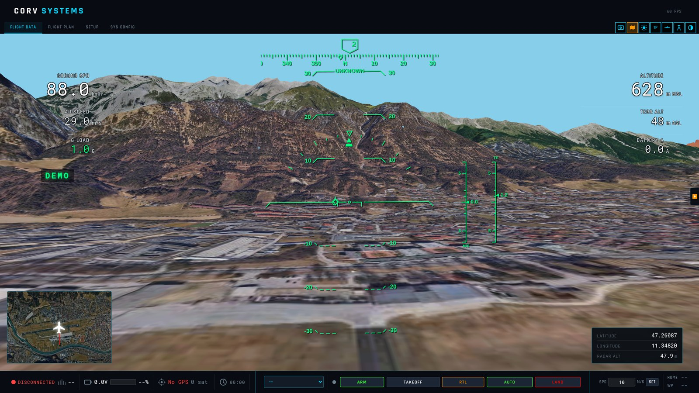
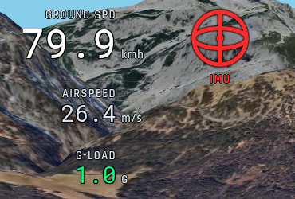
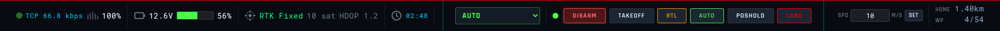

# Flight screen

The **FLIGHT DATA** tab: the terrain ahead in 3D, an aviation-style head-up display over it, data
cells on both sides, the annunciators, a mini-map, and the command bar along the bottom.

## The HUD

Speed, altitude, heading, vertical speed and G-load are drawn the way an airliner's head-up display
draws them — pitch ladder, flight-path marker, bank arc, heading tape — so the picture reads at a
glance. The flight-path marker shows where the aircraft is moving through the air (the wind estimate
is taken out), not just where the nose points. Across the top the flight mode and, in AUTO, the
distance to the waypoint and the cross-track error. Autopilot messages (`STATUSTEXT`) appear on the
left, critical ones in red; a DISARMED banner covers the HUD while the motors are disarmed.

The six **data cells** beside the HUD (three left, three right) are configurable in
**SYS CONFIG → HUD DATA FIELDS**: airspeed, ground speed, vertical speed, G-load, altitude MSL,
height above ground, LiDAR range, roll / pitch / yaw, battery voltage / current / %, satellites,
HDOP, link quality, vibration X/Y/Z, angle of attack, sideslip, RTK baseline and accuracy — each
with a multiplier and a unit label.

## View controls

The buttons in the top-right corner, and their keys (flight screen only, not while typing):

| Button | Key | |
|--------|-----|---|
| FPV camera | | Video stream: 1st click camera only, 2nd click camera with the 3D view blended over it (AR), 3rd click off |
| Satellite | **M** | Satellite imagery on the terrain, or the **schematic chart** (below) |
| Sunlight | **L** | Realistic sun position and shading for the time of day, or flat light |
| 1P / 3P | | First-person view from the aircraft, or the chase camera |
| Horizon lock | **T** | The first-person view keeps the horizon level: pitch no longer tilts the camera |
| Trajectory | **P** | The predicted path: a corridor from about 2 m wide at the aircraft to 12 m at the end of the prediction, with a bar every 5 s |
| Theme | | Dark or light interface |

**First person (1P)**: hold the **arrow keys** to look around — up/down pitch the view 90°,
left/right turn it 110°; releasing returns to the nose.

**Chase view (3P)**: drag with the mouse to orbit the aircraft, scroll to zoom (50 m to 2.5 km). The
camera stays at least 30 m above the terrain under it, except over water, where it can follow a ROV
under the surface. Far out, a ring marks the aircraft.

## Satellite detail

Around the aircraft the 3D view draws sharper imagery than on the rest of the terrain, up to the zoom
chosen in **SYS CONFIG → SYSTEM CONFIG → 3D SATELLITE DETAIL**:

| Zoom | Ground pixel (mid latitudes) | |
|------|------------------------------|---|
| 16 | 1.6 m | Off: the terrain textures alone |
| 17 | 0.8 m | |
| 18 | 0.4 m | Default |
| 19 | 0.2 m | |
| 20 | 0.1 m | The sharpest the imagery has |

The sharper levels cover less ground (zoom 20: about 200 m around the aircraft) and are used only
when the camera is close enough to show them: at 1000 m above the ground zoom 17 and 18 are enough.
Each step up doubles the detail, and the tiles downloaded when flying low and fast — at zoom 20,
50 m above the ground at 26 m/s, about 0.5 MB/s. The tiles are kept for offline use like those of
the 2D map; where none is available the terrain texture shows.

## Schematic chart

With the satellite imagery off (**M**) the terrain becomes a chart, in the style of the mission
simulations in *Top Gun: Maverick*: black sky, near-black ground with a fixed north-west hillshade,
contour lines every 10 m with brighter ones every 50 m and amber ones every 250 m (each level fades
out where its lines would crowd), a white line along every ridge that hides the ground behind it and
a brighter one along the horizon, a faint 1 km grid, out to 30 km. **MAP BRIGHTNESS** in SYS CONFIG
scales the whole drawing. With the light theme it is green relief under a pale blue sky.

The schematic chart is also where the GCS draws the height cue for flying low, water surfaces and
the relative navigation frame — see [3D view, water and ROVs](3D-NAVIGATION.md).

## What is drawn over the terrain

- **Mission route**, as the flight plan draws it: plain waypoints with number and height, surveys as
  dashed passes, circles as rings with the direction of turn, landing and return to launch as flown
  — details in [3D view, water and ROVs](3D-NAVIGATION.md#1-the-mission-in-3d).
- **Home**: a ring on the ground, a pole and the H symbol.
- **Trail**: the path already flown, a thick red line.
- **ADS-B traffic** (when enabled in SYS CONFIG → GCS OPTIONS): the nearest aircraft as red circles
  with callsign and height relative to yours, trailing the path they flew — see ArduPilot's
  [ADS-B receiver](https://ardupilot.org/copter/docs/common-ads-b-receiver.html) page for the
  vehicle side.
- Lines and symbols stay a readable size in pixels at any distance; where the terrain hides them
  they are drawn again, faint.

## Annunciators

A column beside the speed tape flags anything wrong: red **warnings** from the top, amber
**cautions** from the bottom — GPS quality (satellites and HDOP under the flag), compass and IMU
health, vibration, EKF variance, radio signal (RSSI under the flag), failsafes. They are the
conditions Mission Planner checks; the ArduPilot pages on
[pre-arm checks](https://ardupilot.org/copter/docs/common-prearm-safety-checks.html),
[vibration](https://ardupilot.org/copter/docs/common-measuring-vibration.html) and the
[EKF](https://ardupilot.org/copter/docs/common-apm-navigation-extended-kalman-filter-overview.html)
explain each one.

Click a flag to silence it: it stays hidden until the next connection. Silencing a warning also
hides its milder caution (EKF, vibration, GPS, battery, link); silencing a caution still lets the
warning through if the condition gets worse.

## Command bar

Left to right:

| | |
|---|---|
| **Link** | Connection type, data rate, five signal bars (RSSI, or the LTE signal in dBm on a cellular link) |
| **Battery** | Voltage, bar and percentage (from the vehicle, or from the voltage range set in SYS CONFIG → GCS OPTIONS) |
| **GPS** | Fix type (colour: green RTK fixed, yellow RTK float, cyan 3D / DGPS, red below), satellites, HDOP. A fix older than 5 s shows as *No GPS* |
| **Timer** | Flight time |
| **Flight mode** | The current mode, coloured by kind — yellow manual, cyan assisted, green automatic, orange return / land — and a list to change it. See [Flight modes](flight-modes.md) |
| **ARM / DISARM** | Arming asks for confirmation and shows whether the pre-arm checks pass; **FORCE ARM** skips them (only if you know which check fails and why) |
| **TAKEOFF** | Asks for a height above ground, switches to [GUIDED](https://ardupilot.org/copter/docs/ac2_guidedmode.html), **arms the motors if they are not armed**, and sends `MAV_CMD_NAV_TAKEOFF` to that height (a Copter take-off) |
| **RTL / AUTO / LAND** | Switch to the [RTL](https://ardupilot.org/copter/docs/rtl-mode.html), [AUTO](https://ardupilot.org/copter/docs/auto-mode.html) (the loaded mission) or [LAND](https://ardupilot.org/copter/docs/land-mode.html) mode |
| **SPD … SET** | Target speed in m/s, sent as `MAV_CMD_DO_CHANGE_SPEED` on Enter |
| **HOME / WP** | Distance to home and to the active waypoint |

## Mini-map and tables

The **mini-map** (bottom left) shows the vehicle, its track, home, the mission and traffic on
satellite imagery; click it to swap it with the 3D view, click the view to swap back. Bottom right:
latitude, longitude and radar altitude — or, in the relative navigation mode, the velocity VX / VY /
VZ — and the ADS-B traffic table.

## FPV video

The FPV button shows an RTSP camera stream (SIYI HM30 and similar; address, port, path and frame
rate in **SYS CONFIG → SIYI CAMERA STREAM**), decoded in hardware when the PC can. In AR mode the 3D
view is blended over the camera image with the terrain hidden, so the route and the HUD overlay the
real picture.

## Logs and replay

Every connection is recorded as a MAVLink `.tlog` from the moment the link comes up, in
`data/logs`. In the side panel (the arrow on the right edge of the screen), **LOG REPLAY → OPEN LOG FILE…** replays a `.tlog` or an ArduPilot DataFlash `.bin`
on the same screen, with a timeline to play, pause and scrub; replay is available while no vehicle
is connected. ArduPilot's [logs](https://ardupilot.org/copter/docs/common-logs.html) page explains
the two kinds of log.
