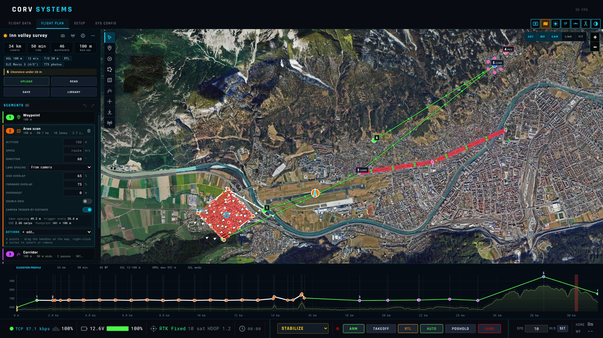
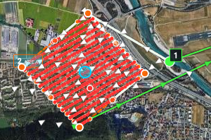

# Mission planning

The **FLIGHT PLAN** tab. You draw the mission as shapes — a waypoint, a circle to loiter in, a
perimeter, an area to photograph, a corridor, a point for the camera, a landing — and the route
between them is calculated a moment after every edit, the way UgCS works. The calculated route is a
list of ArduPilot mission commands; this chapter says which ones, with the ArduPilot page for each,
so you know exactly what the autopilot will fly.

## The page

| Where | What |
|-------|------|
| Left panel, top | [Route card](#route-card): name, status, statistics, settings, warnings, UPLOAD / READ / SAVE / LIBRARY |
| Left panel, below | [Segments](#segments): one card per segment, in flight order |
| Left edge of the map | [Tool palette](#drawing): the tools to draw each kind of segment |
| Top right of the map | [Map layers](#map-layers): SAT, WP, CAM, LINK, FIT |
| Bottom | [Elevation profile](#elevation-profile): the ground under the route and the height flown |

## Drawing

The **tool palette** on the left edge of the map, with its keys:

| Tool | Key | How to draw |
|------|-----|-------------|
| Select / pan | **V** | Click a segment to select it, drag the map to pan |
| Waypoint | **W** | Click on the map |
| Circle | **C** | Click the centre |
| Perimeter | **P** | Click each vertex; **Enter** or a click on the first point closes it |
| Area scan | **A** | Click each corner of the polygon; **Enter** or a click on the first point closes it |
| Corridor | **K** | Click along the centre line; **Enter** finishes |
| Point of interest | **I** | Click the point the camera should look at |
| Landing | **L** | Click the landing point |
| Operator | **O** | Click where the ground antenna will be (for the [radio link](radio-link.md)) |

**Esc** cancels the drawing in progress, then returns to select, then deselects. A hint at the top of
the map says what the current tool expects.

**Editing on the map**: drag a point to move it; drag the small **mid-point handle** between two
vertices to insert a vertex there; drag the **centre handle** to move a whole shape; drag a circle's
**rim handle** to change its radius. The **H** marker is the take-off point and the antenna marker the
operator: both can be dragged.

**Right-click** opens a context menu:

| Right-click on | Menu |
|----------------|------|
| Empty map | **Add waypoint here**, **Add POI here**, **Take-off point here**, **Operator here**, **Deselect** |
| A segment | **Select …**, **Delete segment** |
| A vertex of a perimeter, area or corridor | also **Insert vertex after**, **Delete vertex** (down to 3 points for a polygon, 2 for a line) |
| While drawing | **Finish drawing**, **Cancel drawing** |

**Delete** / **Backspace** removes the selected segment. **Ctrl+Z** undoes, **Ctrl+Y** (or
Ctrl+Shift+Z) redoes — also with the arrows at the top of the segments list.

## Route card

| Part | |
|------|---|
| **Status dot** | grey: empty route; green: ready; amber: warnings; red: errors — **errors block the upload** |
| **Route name** | Type a name; it is the name the mission is saved under. |
| **Camera** icon | Camera & gimbal popover — see [camera surveys](#camera-surveys). |
| **Radio** icon | Radio link popover — see [radio link planning](radio-link.md). |
| **Gear** icon | Route settings popover — see [route settings](#route-settings). |
| **⋯** | Route menu (below). |
| **LENGTH / TIME / WAYPOINTS / MAX AGL** | Total distance, flight time at the planned speeds, number of mission items, highest point above the ground. |
| **Chips** | A summary of the route settings — altitude mode and default height, speed, take-off height, end action, spline, camera, number of photos, radio link. Click them to open the route settings. |
| **Issues** | Every warning (amber) and error (red), one line per problem: a leg through the ground, below the minimum clearance, above the maximum AGL, out of radio range, a feature the flight stack cannot fly, a link that speaks the wrong protocol. |
| **UPLOAD** | Writes the calculated mission to the autopilot. |
| **READ** | Reads the mission stored on the autopilot into the editor. |
| **SAVE** | Saves the route in the local library. |
| **LIBRARY** | Opens the [mission library](#mission-library). |

The **route menu** (⋯):

| Item | |
|------|---|
| **New route** | Starts an empty route (asks first if the current one has segments). |
| **Invert direction** | Flies the segments in reverse order, perimeters and corridors backwards; a final landing stays last. |
| **Convert to waypoints** | Replaces every segment with the calculated waypoints: a survey becomes its individual legs, which you can then move one by one — but areas and corridors are no longer editable as shapes. |
| **Zoom to route** | Fits the map to the route (same as FIT). |
| **Import .waypoints…** | Loads a Mission Planner `.waypoints` / `.txt` file or a `.json` route. |
| **Export .waypoints** | Saves the calculated mission as a Mission Planner `.waypoints` file. |
| **Clear route** | Removes every segment (asks first). |

## Segments

The **SEGMENTS** list has one card per segment, in flight order, with its count in the title. A
card shows the segment's colour, type and number; click it to select the segment (the map shows it
highlighted) and open its settings and actions inline. **Drag a card by its title** to move the
segment earlier or later in the flight. The **trash** icon on the card deletes it. A segment with a
problem shows it on its card.

Every numeric field left empty or at 0 takes the **route default** (the placeholder says *route*).

| Segment | Settings (default) |
|---------|--------------------|
| **Waypoint** | Altitude (route), Speed (route), Turn type (route default / straight / spline), Hold (0 s — wait there), Accept radius (auto — how close counts as reached) |
| **Circle** | Altitude (route), Radius (50 m), Loops (1), Direction (clockwise / counter-clockwise), Speed (route) |
| **Perimeter** | Altitude, Speed, Direction (as drawn / reversed), Return to start (on — closes the loop) |
| **Area scan** | Altitude, Speed, Direction (0° — the lanes' bearing), Lane spacing (*From camera* / *From mapping sensor* / *Manual*), Side distance (30 m, manual), Sensor swath angle / Sensor range / Distance to the surface (90°, 90 m, 30 m — sensor), Side overlap (70 %), Forward overlap (80 %), Overshoot (0 m — extend each lane beyond the polygon, for a plane to turn outside it), Double grid (off — a second set of lanes at 90°, for 3D models), Camera trigger by distance (on) |
| **Corridor** | Altitude, Speed, Corridor width (60 m), the same lane spacing, overlap and trigger settings as an area |
| **Point of interest** | Camera (*Look at this point* / *Stop looking (ROI off)*), Target height (0 m — of the point looked at) |
| **Landing** | VTOL landing (off), Abort altitude (off — the height to climb to if the landing is aborted) |

### Actions

The **+ add…** list on a card adds an action, run at the segment start or at every point of it
(route setting *Segment actions run*); actions the flight stack cannot fly are greyed out with the
reason. Each action has its own fields and a **×** to remove it:

| Action | Fields | Command |
|--------|--------|---------|
| Camera trigger by distance | Every (20 m; 0 = stop) | `DO_SET_CAM_TRIGG_DIST` (206) |
| Take a photo | — | `DO_DIGICAM_CONTROL` (203) |
| Camera attitude | Pitch (−90° = straight down), Yaw | `DO_MOUNT_CONTROL` (205) |
| Set heading | Heading (°) | `CONDITION_YAW` (115) |
| Wait | Duration (5 s) | `NAV_DELAY` (93) |
| Change speed | Speed (m/s) | `DO_CHANGE_SPEED` (178) |
| Set servo | Channel, PWM (µs) | `DO_SET_SERVO` (183) — see [servo](https://ardupilot.org/copter/docs/common-servo.html) |
| Set relay | Relay, State (on / off) | `DO_SET_RELAY` (181) — see [relay](https://ardupilot.org/copter/docs/common-relay.html) |
| MAVLink command | Command number, Param 1–4 | any command — what a mission read from a vehicle keeps when it has no editor |

ArduPilot runs a `DO_` command once the navigation command before it is reached, so actions are
placed after the segment's point.

## Segments and the commands they become

| Segment | Mission commands | ArduPilot |
|---------|------------------|-----------|
| **Waypoint** | `NAV_WAYPOINT` (16), or `NAV_SPLINE_WAYPOINT` (82) with the spline turn type; hold time and acceptance radius | [Mission commands](https://ardupilot.org/copter/docs/mission-command-list.html) |
| **Circle** | `NAV_LOITER_TURNS` (18): turns, radius; a negative radius turns counter-clockwise. ArduPilot flies to the edge of the circle, not its centre | [Loiter turns](https://ardupilot.org/copter/docs/mission-command-list.html) |
| **Perimeter** | `NAV_WAYPOINT` at every vertex, as drawn or reversed, optionally back to the first | |
| **Area scan** | Parallel lanes of `NAV_WAYPOINT` across the polygon (direction, overshoot, optional cross grid), with `DO_SET_CAM_TRIGG_DIST` (206) started on the first lane and stopped after the last | [Cameras and gimbals](https://ardupilot.org/copter/docs/common-cameras-and-gimbals.html) |
| **Corridor** | Parallel passes of `NAV_WAYPOINT` along the line, covering the width; camera trigger as above | |
| **Point of interest** | `DO_SET_ROI_LOCATION` (201) — the camera / nose points at it — or `DO_SET_ROI_NONE` (197) to stop | [Mission commands](https://ardupilot.org/copter/docs/mission-command-list.html) |
| **Landing** | `NAV_LAND` (21), or `NAV_VTOL_LAND` (85) for a VTOL, with an abort altitude | [Plane automatic landing](https://ardupilot.org/plane/docs/automatic-landing.html) |

Around them the route adds `NAV_TAKEOFF` (22) when automatic take-off is on (15° climb pitch on a
plane), `DO_CHANGE_SPEED` (178) wherever the speed changes, and at the end `NAV_RETURN_TO_LAUNCH`
(20) or a landing in place.

The full reference of every command and parameter is ArduPilot's
[MAVLink mission commands](https://ardupilot.org/copter/docs/common-mavlink-mission-command-messages-mav_cmd.html)
page ([Plane version](https://ardupilot.org/plane/docs/common-mavlink-mission-command-messages-mav_cmd.html)).

## Route settings

The gear icon on the route card (or a click on the chips):

| Setting | Default | |
|---------|---------|---|
| **Altitude mode** | AGL — follow terrain | AGL, AMSL — constant, or Relative to take-off (below) |
| **Default altitude** | 100 m | For every segment without its own |
| **Terrain-following waypoints** | off | AGL only: adds intermediate waypoints so the straight legs stay within the AGL tolerance of the terrain |
| **AGL tolerance** | 10 m | How far a leg may depart from the planned height above ground before a waypoint is added |
| **Default speed** | 10 m/s | 0 = the vehicle's own speed (`WPNAV_SPEED`, cruise) |
| **Turn type** | Straight | Straight legs, or spline curves through the waypoints |
| **Automatic take-off** | on | Starts the mission with `NAV_TAKEOFF` |
| **Take-off altitude** | 30 m | |
| **After last segment** | Return to launch | Return to launch, Land in place, Nothing |
| **Max altitude AGL** | 120 m | Warns above it (0 = no limit) — the usual legal ceiling |
| **Min clearance** | 20 m | Warns where a leg passes closer to the ground |
| **Segment actions run** | At segment start | Or at every point of the segment |
| **Waypoint altitudes AMSL** (INAV) | off | INAV 5+: absolute altitudes instead of relative to the arming point |
| **Store mission on the board** (INAV) | off | Also writes the mission to the board's storage so it survives a power cycle |

**TAKE-OFF POINT** at the bottom: where the route starts. *vehicle home* by default (it follows the
vehicle's home when connected); **VEHICLE** puts it at the vehicle's current position; **AUTO** goes
back to following home; or drag the **H** marker on the map / right-click → *Take-off point here*.

## Altitudes and terrain

| Mode | The height you type is | Sent to the autopilot as |
|------|------------------------|--------------------------|
| **AGL — follow terrain** | above the ground under each waypoint | resolved against the elevation model |
| **AMSL — constant** | above mean sea level | absolute |
| **Relative to take-off** | above the take-off point | relative |

In AGL mode each waypoint sits at its height above the ground under it and the vehicle flies straight
from one to the next. With **Terrain-following waypoints** on, intermediate waypoints are added so the
straight legs stay within the **AGL tolerance** of the terrain. Every leg — not just every waypoint —
is checked against the terrain: a leg that dips under **Min clearance** is a warning, one that goes
through the ground an error; **Max altitude AGL** warns above a ceiling. A rover, a boat or a sub is
not checked: it goes on (or under) the surface the elevation model holds — on a lake, its water. The autopilot's own terrain
following (with its terrain database) is described in ArduPilot's
[terrain following](https://ardupilot.org/copter/docs/terrain-following.html) page; the GCS does the
work in advance, so the mission flies the same with or without it.

When the autopilot's terrain database is on (`TERRAIN_ENABLE`), the vehicle asks the GCS for the
terrain around it and the GCS answers from the same SRTM tiles, as Mission Planner does — the area
around the vehicle (9 grids, at the default 100 m spacing) loads in about 40 s. Where a tile is
missing or has holes, the GCS does not answer rather than send a made-up height; the vehicle keeps
asking and shows the terrain as pending. If blocks stay pending and the vehicle asks for nothing, it
is stuck reading its own SD card (missing, full or failing): the HUD shows *TERRAIN: vehicle SD card
not readable*, and the GCS cannot help until the card is fixed and the autopilot rebooted.

## Camera surveys

The **camera & gimbal** popover (camera icon on the route card): pick a preset (DJI Mavic 3, Zenmuse
H20 / P1, Sony α6000, RX1R II, MicaSense RedEdge…) or enter **sensor width / height** (mm), **focal
length** (mm) and **image width / height** (px). Underneath, what it gives: the field of view, the
ground footprint at the route's default altitude, the ground sample distance (cm per pixel) and the
gimbal angles. **Default camera pitch** (−90° = straight
down) and **yaw** (relative to the flight direction) apply unless a segment has a camera-attitude
action.

An area scan with *Lane spacing: From camera* then works out the lane spacing from the side overlap
and the photo interval from the forward overlap — a Mavic 3 at 100 m gives 49 m between lanes, a
photo every 26 m and 2.7 cm per pixel on the ground. Every planned photo is a **red dot** on the
route; hover it to see the rectangle it covers. While a point of interest is active, hover a waypoint
to see the wedge the camera looks through.

## Sonar and LiDAR surveys

For a sensor that sweeps a fan under the vehicle — an imaging or multibeam sonar, a LiDAR — set the
area scan's **Lane spacing** to *From mapping sensor*: give the fan's **Sensor swath angle** (across
the track), its **Sensor range** and the **Distance to the surface** (the depth under a boat; empty:
the segment's altitude). The swath is the narrower of the aperture's width at that distance and the
width the range reaches (2·√(range² − distance²)); the lanes are spaced by the swath less the **Side
overlap**, and the card says which of the two limited it. A 90° sonar with 90 m of range at 30 m
sweeps 60 m: 30 m between lanes with 50 % overlap. Choose the design distance from the shallowest
water that must be covered: the swath narrows with depth, so lanes spaced for 30 m leave gaps where
the bed is shallower than 15 m. With 50 % overlap the bed under each lane is also seen by the next
lane's outer beams, where the water under a hull is noisy. A mechanical sector-scanning sonar
(Ping360, Imagenex 881, Tritech Micron class) sweeps its sector one ping at a time — a sweep every
4–6 s — so its swath is its sector, but how close its samples fall along the track is set by the
speed: 1–1.5 m/s for a sweep every 5–7 m. A boat's mission has no take-off; no
camera is triggered. ArduRover starts AUTO on a boat in loiter, and a speed change ahead of the first
waypoint would set the loiter's speed instead of the survey's: the planner puts a boat's first speed
change just after the first waypoint, where it takes effect as the boat sets off. During the survey the ROS strip shows how much of each planned area is covered
([ROS](ROS.md#5-worked-examples)).

## Map layers

| Button | |
|--------|---|
| **SAT** | Satellite imagery on / off (off: a plain map) |
| **WP** | The calculated waypoints (every leg of a survey) |
| **CAM** | Photo footprints and POI view cones |
| **LINK** | Radio coverage from the operator position ([radio link](radio-link.md)) |
| **FIT** | Zoom the map to the whole route |

## Elevation profile

Along the bottom: the ground under the whole route (from the elevation model) and the height flown,
with the take-off at the left. Hover it to see the point on the map, the distance along the route,
the segment, the height above ground and the terrain height; legs too close to the ground stand out.
With the radio link on, a band under it shows the link along the route, and the tooltip adds the
signal, the margin and the distance from the ground station.

## Upload, read, save

- **UPLOAD** sends the calculated mission to the autopilot (MAVLink mission protocol, or MSP on INAV).
  Errors block it; warnings do not.
- **READ** brings back the mission stored on the autopilot, turned into segments — one waypoint per
  navigation command, loiters as circles, the rest as actions.
- **SAVE** keeps the route, with its segments, in the [mission library](#mission-library), so it can
  be edited again.
- The **⋯** menu exports a Mission Planner `.waypoints` file and imports `.waypoints`, `.txt` or `.json`.

The mission flown is shown on the flight screen in 3D the way this page draws it — see
[the mission in 3D](3D-NAVIGATION.md#1-the-mission-in-3d).

## Mission library

**LIBRARY** opens a full-screen page (× to close):

| | |
|---|---|
| **SAVE AS NEW** | Saves the current plan as a new mission. |
| **OPEN FOLDER** | Opens `data/missions` in the file manager (the path is shown beside it). |
| **SAVED MISSIONS** | One row per mission: name, waypoints, length, date (the one being edited is highlighted). **LOAD** replaces the current plan with it; **OVERWRITE** saves the current plan over it; **REN** renames; **DEL** deletes. |
| **FLIGHT LOGS** | The `.tlog` files recorded by the GCS, newest first (the 50 most recent). Replay them from the [side panel](side-panel.md#log-replay). |

## INAV

On INAV the same plan is uploaded over MSP as an INAV waypoint list: navigation and hold points, POI,
heading, speed, landing and return to home, with the altitudes the terrain model worked out. What the
INAV format cannot carry is greyed out while you plan, with the reason on the control: no loiter
circles, no spline legs, no take-off waypoint, no camera, gimbal, servo or relay actions, and at most
60 waypoints (the board's own figure once connected; the chip shows `n / 60 WP`). Two INAV-only
settings: absolute (MSL) waypoint altitudes for INAV 5 or later, and storing the mission in the
board's memory after the upload.
