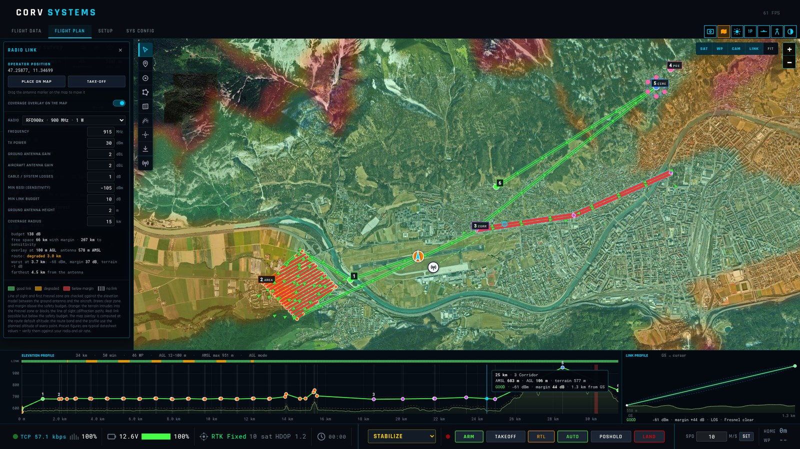
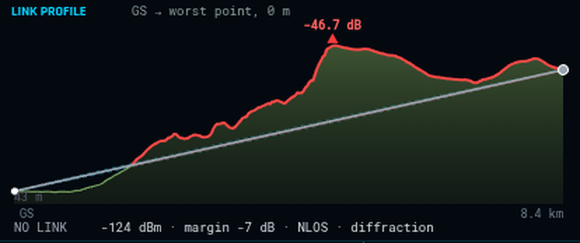

# Radio link planning

A drone is only as far away as its radio reaches, and hills get in the way. On the **FLIGHT PLAN**
page the **LINK** layer shows where the telemetry link will work over the real terrain, and checks the
planned route against it.

## Set it up

1. **The radio** — radio icon on the route card. Pick one from the list or enter your own:

   | Preset | Frequency | TX power | Sensitivity |
   |--------|-----------|----------|-------------|
   | RFD900x | 915 MHz | 30 dBm (1 W) | −105 dBm |
   | RFD868x | 868 MHz | 27 dBm | −105 dBm |
   | SiK telemetry 433 / 915 | 433 / 915 MHz | 20 dBm (100 mW) | −108 dBm |
   | Herelink | 2.4 GHz | 20 dBm | −98 dBm |
   | Microhard pMDDL2450 | 2.45 GHz | 30 dBm | −96 dBm |
   | Doodle Labs Mesh Rider | 2.45 GHz | 30 dBm | −98 dBm |
   | ExpressLRS 900 / 2.4 | 915 MHz / 2.44 GHz | 30 / 24 dBm | −117 / −108 dBm |
   | TBS Crossfire | 900 MHz | 33 dBm (2 W) | −120 dBm |

   The figures are typical datasheet values for planning; check them against your hardware and air
   rate. You can also set the antenna gains on the ground and on the aircraft, cable and system
   losses, the **minimum link budget** (the margin above the sensitivity you want), the ground antenna
   height and the radius of the coverage map. The radio is remembered for the next route.
2. **The operator** — tool **O**: click where the ground antenna will be. Without it the take-off
   point is used.
3. **LINK** — turn the layer on.

## Reading the map

| Colour | |
|--------|---|
| light green | the link works with at least the minimum margin |
| orange | it works, but the terrain costs part of it |
| red | it works, with less than the minimum margin |
| nothing | no link |

The planned route gets a halo in the same colours, and a band under the elevation profile shows the
link along the whole flight.

The **LINK PROFILE** cut shows the terrain between the antenna and the point under the cursor — or
the worst point of the route — with the Earth's bulge, the first **Fresnel zone** and its 60 % core,
the ground that intrudes into it in red, and the loss at the worst ridge. In the picture a mountain
between operator and aircraft costs 46.7 dB and the link is lost.

## The model

The check is the one an RF planner makes: free-space path loss for the frequency and distance, a
straight line of sight from antenna to aircraft, the first Fresnel zone around it (the radio needs
that ellipse clear, not just the line), the diffraction loss when a ridge cuts into it, and the
curvature of the Earth. It does not model vegetation, buildings, rain, interference or antenna
patterns — read it as the best case over bare terrain.

ArduPilot's [telemetry](https://ardupilot.org/copter/docs/common-telemetry-landingpage.html) pages
cover the radios themselves and their setup on the vehicle; what the vehicle does when the link is
lost is its GCS failsafe — see [Vehicle setup → Failsafe](setup.md#failsafe).
