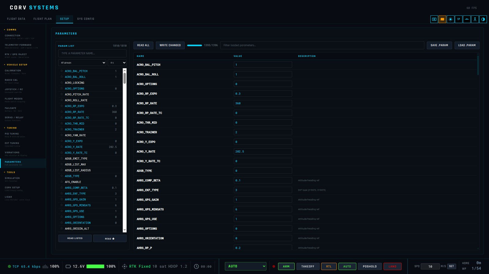

# Vehicle setup

The **SETUP** tab groups the pages by what they do: **COMMS**, **VEHICLE SETUP**, **TUNING**,
**TOOLS**. **SYS CONFIG** holds the settings of the GCS itself. On an INAV or Betaflight link (MSP)
the pages that only speak MAVLink are greyed out, each saying where that setting lives instead.

Calibration, failsafes and tuning change how the vehicle flies: follow the ArduPilot page linked in
each section for your vehicle type and firmware version.

## COMMS

### Connection
Serial, UDP, TCP, MSP or CORV binary links, the system ID to talk to, and the firmware the vehicle
reports — see [Getting started](getting-started.md#connect-a-vehicle).

### Cellular link
A link over the mobile network to an LTEtelem module on the vehicle, through a relay: module ID and
its AES-256 key (optionally remembered through the operating system's keychain), relay host and
port, and a pinned TLS certificate. Everything after the handshake is encrypted end to end; the relay
cannot read it. The status panel shows the state, the module's session, records in and out, rejected
records, traffic and reconnects; the command bar shows the LTE signal in dBm on its bars.

### Telemetry forward
Copies of the telemetry for other equipment: **LTM** or **MAVLink passthrough** on a serial port (an
antenna tracker, an OSD), or a **UDP** mirror for another GCS. Several outputs can run at once.

### RTK GPS
Corrections for centimetre positioning, forwarded to the vehicle as `GPS_RTCM_DATA`: from an **NTRIP
caster** (host, port, mountpoint, credentials; the sourcetable can be listed; GGA position upload for
VRS networks) or a **serial base station**. The page shows the stream, the RTCM message types
received and the vehicle's RTK state (fix, baseline, accuracy). ArduPilot:
[RTK correction](https://ardupilot.org/copter/docs/common-rtk-correction.html),
[GPS for yaw](https://ardupilot.org/copter/docs/common-gps-for-yaw.html).

## VEHICLE SETUP

### Accelerometer
The six-position calibration as Mission Planner runs it: **CALIBRATE ACCEL**, then for each position
the autopilot asks for (level, left side, right side, nose down, nose up, on its back) hold the vehicle
still that way and press **CONTINUE**. **CALIBRATE LEVEL** sets the level trim (AHRS_TRIM),
**SIMPLE ACCEL CAL** is the one-position calibration for vehicles too large to turn over. The stored
offsets and scale factors are listed underneath. ArduPilot:
[accelerometer calibration](https://ardupilot.org/copter/docs/common-accelerometer-calibration.html).

### Compass
Onboard calibration: **START**, then turn the vehicle through every attitude until each compass's bar
is full; **ACCEPT** saves a result that was not auto-saved, **CANCEL** stops. The 3D view plots every
magnetometer sample around the vehicle and shades the sphere green where the autopilot has samples:
turn the vehicle until the white marker reaches the orange patch. Underneath, the compasses in priority
order and **LARGE VEHICLE MAGCAL**, which calibrates from a known heading without turning the vehicle.
ArduPilot: [compass calibration](https://ardupilot.org/copter/docs/common-compass-calibration-in-mission-planner.html),
[large vehicle MagCal](https://ardupilot.org/copter/docs/common-compass-calibration-in-mission-planner.html#large-vehicle-magcal).

### Gyro / Baro
**CALIBRATE GYROS** measures the gyro offsets with the vehicle still; **CALIBRATE BARO** takes the current
pressure as ground level.

### Radio calibration
Live bars of every RC input channel; **START CALIBRATION**, move every stick and switch to its ends,
**SAVE CALIBRATION**. ArduPilot:
[radio control calibration](https://ardupilot.org/copter/docs/common-radio-control-calibration.html).

### Joystick
Fly with a gamepad through RC override, at a chosen send rate, with per-axis calibration. ArduPilot:
[joystick](https://ardupilot.org/copter/docs/common-joystick.html). A sub driven from the GCS only takes
pilot input from its own GCS system ID.

### Flight modes
The mode channel and the six modes on its switch positions, read from and written to the vehicle —
see [Flight modes](flight-modes.md). ArduPilot:
[flight mode configuration](https://ardupilot.org/copter/docs/common-rc-transmitter-flight-mode-configuration.html).

### Failsafe
**Battery** and **RC / GCS** failsafe parameters: thresholds and actions, read from and written to the
vehicle. What each action does is the vehicle's: ArduPilot
[Copter](https://ardupilot.org/copter/docs/failsafe-landing-page.html),
[Plane](https://ardupilot.org/plane/docs/apms-failsafe-function.html),
[Rover](https://ardupilot.org/rover/docs/rover-failsafes.html),
[Sub](https://ardupilot.org/sub/docs/failsafe-landing-page.html) failsafes, and the Copter
[dead-reckoning failsafe](https://ardupilot.org/copter/docs/deadreckoning-failsafe.html) for a GPS lost
in flight.

### Servo / relay
The servo outputs live, relay switches, and a manual servo test (a PWM on a channel). ArduPilot:
[servo](https://ardupilot.org/copter/docs/common-servo.html),
[relay](https://ardupilot.org/copter/docs/common-relay.html),
[auxiliary functions](https://ardupilot.org/copter/docs/common-auxiliary-functions.html).

## TUNING

### PID tuning
The main gains by vehicle: on a copter the rate PIDs, the angle P gains and the attitude limits; on a
plane the roll and pitch controllers and **TECS** speed/height. **READ FROM VEHICLE**, edit,
**WRITE ALL**. ArduPilot: [tuning process](https://ardupilot.org/copter/docs/tuning-process-instructions.html),
[AutoTune](https://ardupilot.org/copter/docs/autotune.html).

### Extended tuning
Further tuning parameters of the vehicle type, read and written as a group.

### Vibration
Vibration on the three axes and the accelerometer clipping counts, live, with their history — the
numbers behind the vibration annunciator. ArduPilot:
[measuring vibration](https://ardupilot.org/copter/docs/common-measuring-vibration.html).

### Parameters

The full parameter editor: search, inline editing, **WRITE CHANGED**, **LOAD .PARAM** / **SAVE .PARAM**.
**READ ALL** loads the whole list; **READ LISTED** reads only the parameters on the page, one request
each — on a slow long-range radio that is the difference between a few packets and several minutes.
Descriptions come with the parameters; the reference is ArduPilot's
[Copter](https://ardupilot.org/copter/docs/parameters.html) /
[Sub](https://ardupilot.org/sub/docs/parameters.html) parameter lists (and those of the other vehicles).

## TOOLS

### Simulation
ArduPilot SITL with one click — see [Simulator](simulator.md).

### CORV setup
Configuration of the onboard CORV autopilot over its binary protocol: GPS, telemetry output, board and
hardware, feature flags, and its particle-filter / EKF noise settings.

### LiDAR
A Livox Mid-360 point cloud mapped live from the telemetry — see [LiDAR point cloud](LIDAR.md).

## SYS CONFIG

| Panel | |
|-------|---|
| **FLIGHT STACK** | ArduPilot, INAV or Betaflight — see [Getting started](getting-started.md#choose-the-flight-stack) |
| **NAVIGATION** | Absolute or relative position, the velocity dead reckoning uses, fresh or sea water — see [Navigation without GPS](3D-NAVIGATION.md#5-navigation-without-gps) |
| **SYSTEM CONFIG** | Language (English, 中文), altitude offset, terrain folder, 3D model and its scale, time of day, map brightness, attitude smoothing, 3D frame rate (60 or 30 to save battery), DevTools |
| **GCS OPTIONS** | ADS-B traffic overlay, ground clamp (keep the model on the terrain surface), battery voltage range and cells for the percentage when the vehicle does not report one |
| **ROTOR LOAD** | A schematic of the motors coloured by their output, for multirotors: frame, PWM scale and the green / orange / red thresholds |
| **SIYI CAMERA STREAM** | Address, port, path and frame rate of the FPV video |
| **OFFLINE DATA DOWNLOAD** | Satellite tiles and SRTM elevation for an area, ahead of a flight without network |
| **HUD DATA FIELDS** | The six data cells beside the HUD — see [Flight screen](flight-screen.md#the-hud) |
| **MAVLINK STREAM RATES** | How often the vehicle sends each group of messages (raw sensors, status, RC, position, attitude, VFR HUD…); lower them on a slow radio |

The **altitude offset** shifts every vehicle height in the 3D view, to line the reported altitude up
with the terrain model when they disagree (a barometer drift, a different geoid).
