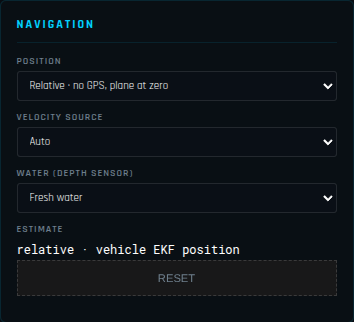

# GCS settings (SYS CONFIG)

The **SYS CONFIG** tab holds the settings of the ground station itself — what it shows and how — as
opposed to [SETUP](setup.md), which configures the vehicle. Everything here is remembered between
sessions on this computer, except where noted. Two panels write to the vehicle: **MAVLINK STREAM
RATES** and, indirectly, the flight stack's suggested link.

| Panel | |
|-------|---|
| [FLIGHT STACK](#flight-stack) | ArduPilot, INAV or Betaflight |
| [NAVIGATION](#navigation) | absolute (GPS) or relative position |
| [SYSTEM CONFIG](#system-config) | language, altitude offset, terrain folder, 3D model, light, smoothing, frame rate, satellite detail, DevTools, debug log |
| [GCS OPTIONS](#gcs-options) | ADS-B traffic, ground clamp, battery voltage range |
| [ROTOR LOAD](#rotor-load) | the motor output schematic |
| [SIYI CAMERA STREAM](#siyi-camera-stream) | the FPV video address |
| [OFFLINE DATA DOWNLOAD](#offline-data-download) | imagery and elevation for an area, ahead of time |
| [HUD DATA FIELDS](#hud-data-fields) | the six data cells beside the HUD |
| [MAVLINK STREAM RATES](#mavlink-stream-rates) | how often the vehicle sends each group of messages |

## FLIGHT STACK

| Field | |
|-------|---|
| **ENVIRONMENT** | *ArduPilot · Copter / Plane / Rover*, *INAV · waypoint missions over MSP*, *Betaflight · acro, no navigation*. Decides the link protocol suggested, which SETUP pages are available and which mission features can be planned. |
| **SUGGESTED LINK** | The connection type and baud rate that go with it (MAVLink serial 57 600, MSP serial 115 200). |

The hint underneath says what changes. Details in
[Getting started → choose the flight stack](getting-started.md#choose-the-flight-stack).

## NAVIGATION

| Field | |
|-------|---|
| **POSITION** | *GPS · absolute, map and terrain* (default) or *Relative · no GPS, plane at zero* — for a vehicle that has never had a GPS: a ROV, a flight with no GNSS. |
| **VELOCITY SOURCE** | What the GCS dead-reckons on when the vehicle sends no local position of its own: *Auto*, *Airspeed + heading*, *Ground speed + heading*, *EKF velocity*. |
| **WATER (DEPTH SENSOR)** | *Fresh* (997 kg/m³) or *Sea* (1 025 kg/m³) water, to turn a sub's pressure into depth. |
| **ESTIMATE** + **RESET** | Where the position comes from right now; RESET starts the relative position and its track again from zero. |

Everything about the relative mode — what it draws, the dead reckoning, what ArduPilot sends without
GPS — is in [navigation without GPS](3D-NAVIGATION.md#5-navigation-without-gps).

## SYSTEM CONFIG

| Field | Default | |
|-------|---------|---|
| **LANGUAGE** | English | English or 中文 (Simplified Chinese), for the whole interface. |
| **ALTITUDE OFFSET (M)** | 0 | Added to every vehicle altitude in the 3D view and the altitude cell, to line the reported altitude up with the terrain model when they disagree (a barometer drift, a different geoid). Not remembered: it is a correction for the flight at hand. |
| **TERRAIN (HGT FOLDER)** + **SELECT HGT FOLDER** | | Load SRTM `.hgt` elevation tiles from a folder of your own (offline, or a better DEM). The line under it shows what is loaded (`NO DATA` before any terrain). Tiles are otherwise downloaded automatically — see [terrain and imagery](getting-started.md#terrain-and-imagery). |
| **3D MODEL** | follows the vehicle | The aircraft model drawn in 3D: the `.glb` / `.gltf` files in the `models/` folder (quadcopter, hexa, octo, tricopter, plane, flying wing, quadplane VTOL, helicopter, rover, boat, ROV, submarine, airship, antenna tracker), plus your own. When a vehicle connects, the model switches to its type; choose another here to override. |
| **MODEL SCALE** | 1.0 | 0.1 to 5×: makes the model larger to find it at a distance, or true to size. |
| **TIME OF DAY (DEBUG)** | the clock | Moves the sun to any time (00:00–24:00) for the sunlight shading — to check a shadow or simply see better. |
| **MAP BRIGHTNESS (STATIC)** | 0.85 | 0.3 to 1.6. Shown only when the sunlight is off or the satellite imagery is off: the brightness of the flat-lit imagery, or of the whole schematic chart. |
| **ATTITUDE SMOOTHING** | 0.15 | 0 to 0.5. How much the aircraft's attitude is interpolated between telemetry samples in the 3D view and HUD: 0 = raw (jerky at low telemetry rates), 0.5 = fully interpolated (smooth, slightly behind). |
| **3D FRAME RATE** | 60 FPS | *60 FPS* or *30 FPS (ECO)*: 30 halves the rendering work — use it on battery or on a weak GPU. |
| **3D SATELLITE DETAIL (ZOOM)** | 18 · 0.4 m | The sharpest imagery drawn around the aircraft: 16 (off) to 20 (0.1 m per pixel). Each step doubles the detail and the download — see [satellite detail](flight-screen.md#satellite-detail). |
| **DEVTOOLS** → **OPEN DEVTOOLS** | | Opens the Chromium developer tools (console, network) in a separate window — for troubleshooting with support. |
| **DEBUG LOG (LAST 5 MIN)** → **SAVE COPY…** | | Saves one file with the last 5 minutes of this session and of the previous one (connections, errors, autopilot messages, commands sent): **send it to support** when reporting a problem. The path saved to is shown underneath. |
| **SHOW FILE** | | Shows the live debug log file in the file manager (`data/debug/corv-gcs-debug.log`, rewritten every few seconds). |

## GCS OPTIONS

| Field | Default | |
|-------|---------|---|
| **ADS-B TRAFFIC** — *Show ADS-B traffic overlay* | on | Manned aircraft from OpenSky and from an onboard receiver, in 3D, on the mini-map and in the traffic table. The same switch as **SHOW ADS-B TRAFFIC** in the side panel. See [ADS-B traffic](flight-screen.md#ads-b-traffic). |
| **GROUND CLAMP** — *Clamp model to terrain surface* | on | Never draws the vehicle under the terrain model: where its altitude is below the ground (SRTM is ±5 m, barometers drift) it is lifted onto the surface, so a landed vehicle sits on the ground. Over water it does not apply (a ROV dives). Untick to see the raw altitude. |
| **BATTERY MIN VOLTAGE** | 9.6 V | The empty voltage, for the battery percentage when the vehicle does not report one. |
| **BATTERY MAX VOLTAGE** | 12.6 V | The full voltage. |
| **CELLS (AUTO)** | 3S | The cell count worked out from the maximum (4.2 V per cell): check it matches your pack. |

Example for a 6S Li-ion pack: min 18.0 V (3.0 V per cell), max 25.2 V.

## ROTOR LOAD

The schematic at the bottom right of the flight screen, each motor coloured by its output.

| Field | Default | |
|-------|---------|---|
| **SCHEMATIC** — *Show rotor load schematic* | on | The same switch as **SHOW ROTOR LOAD** in the side panel. |
| **FRAME** | AUTO (from MAV_TYPE) | Or force: single rotor (plane / heli), tricopter, quad, hexa, octo, deca, dodeca. |
| **MOTORS OFF PWM (SCALE MIN)** | 1000 | The PWM at which the gauges read empty. |
| **SCALE MAX PWM** | 2000 | The PWM at which they read full. |
| **GREEN ABOVE PWM** | 1100 | Below it a motor reads **blue** (stopped). |
| **ORANGE ABOVE PWM** | 1500 | |
| **RED ABOVE PWM** | 1700 | A motor in the red for long is near its limit: no control margin left on that arm. |
| **SINGLE ROTOR CHANNEL** | 3 | For a plane or helicopter, the output shown as the main rotor: ArduPlane throttle = 3, heli RSC = 8. |

On a healthy multirotor in a hover all motors sit in the same colour; one constantly higher shows a
centre of gravity off to that side, a weak motor or a twisted arm.

## SIYI CAMERA STREAM

The RTSP video for the [FPV button](flight-screen.md#fpv-video):

| Field | Default (SIYI) |
|-------|----------------|
| **IP ADDRESS** | 192.168.144.25 |
| **RTSP PORT** | 8554 |
| **STREAM PATH** | /main.264 |
| **TARGET FPS** | 30 (1–60) |

The PC's network adapter needs a static IP in the camera's subnet (for SIYI 192.168.144.x, e.g.
192.168.144.100), and `ffmpeg` must be installed and in the PATH. Any RTSP camera works with its
own address and path (`rtsp://IP:PORT/PATH`).

## OFFLINE DATA DOWNLOAD

Downloads an area ahead of a flight without network.

| Field | |
|-------|---|
| **NORTH LAT / SOUTH LAT / WEST LON / EAST LON** | The box, in whole degrees. |
| **SATELLITE ZOOM MAX** | The sharpest imagery to keep, 1–19 (16 ≈ 2 m per pixel; every level up is four times the tiles). |
| **Satellite tiles** / **SRTM1 elevation** | What to download: imagery, 30 m elevation tiles, or both. |
| Estimate | How many tiles and how much data the choice means — check it before starting. |
| **DOWNLOAD** / **CANCEL** | Start / stop; a progress bar and a status line follow. |

Tiles go to the same cache the GCS fills while flying, so they are used automatically. For a
mission area, a box of 1° × 1° at zoom 16 is a good start; add zoom 18–19 only for the few square
kilometres you will fly low over.

## HUD DATA FIELDS

The six data cells beside the HUD: **LEFT 1–3** and **RIGHT 1–3**, top to bottom. For each:

| Control | |
|---------|---|
| Field | Airspeed, Ground Spd, Vert Speed, G-Load, Altitude (MSL), Terr Alt (AGL), LiDAR, Roll, Pitch, Heading, Battery V / A / %, GPS Sats, GPS HDOP, Link Qual, Vib X / Y / Z, AoA, SSA (sideslip), RTK Base (baseline, mm), RTK Acc (accuracy, mm) |
| Multiplier (×1) | The value is multiplied by it: ×3.6 shows m/s as km/h, ×1.944 as knots, ×3.281 metres as feet. |
| Unit (auto) | Your own unit label for the cell (`km/h`, `kt`, `ft`); empty = the field's own. |

**RESET DEFAULTS** goes back to Airspeed, Ground Spd, G-Load / Altitude, Terr Alt, LiDAR.

## MAVLINK STREAM RATES

How many times a second the vehicle sends each group of messages (`SR0_*`, the rates of the
autopilot's SERIAL0 port, normally its USB):

| Field | Parameter | Default | Carries |
|-------|-----------|---------|---------|
| **RAW SENSORS** | `SR0_RAW_SENS` | 2 | IMU, pressure, raw GPS |
| **EXT STATUS** | `SR0_EXT_STAT` | 2 | system status, battery, GPS status, mission current |
| **RC CHANNELS** | `SR0_RC_CHAN` | 5 | RC inputs, servo outputs (radio calibration, rotor load) |
| **RAW CTRL** | `SR0_RAW_CTRL` | 1 | |
| **POSITION** | `SR0_POSITION` | 3 | GLOBAL_POSITION_INT, LOCAL_POSITION_NED |
| **EXTRA1 (ATTITUDE)** | `SR0_EXTRA1` | 10 | ATTITUDE |
| **EXTRA2 (VFR HUD)** | `SR0_EXTRA2` | 10 | VFR_HUD (speeds, altitude, climb) |
| **EXTRA3** | `SR0_EXTRA3` | 1 | vibration, EKF status, terrain, battery details |
| **PARAMS** | `SR0_PARAMS` | 10 | parameter download rate |

**READ STREAM RATES** loads the vehicle's values; **WRITE STREAM RATES** sends all nine (each field
flashes green when written, red on failure). Lower them on a slow radio (a 19 200-baud link cannot
carry everything at 10 Hz); raise POSITION and EXTRA1 to 10 Hz or more for the [LiDAR](LIDAR.md) and
[ROS](ROS.md) surfaces, which place every point with the telemetry pose. A telemetry radio on
TELEM1 or TELEM2 uses that port's `SR1_*` or `SR2_*`: set those in [PARAMETERS](setup.md#parameters)
with the same values.
